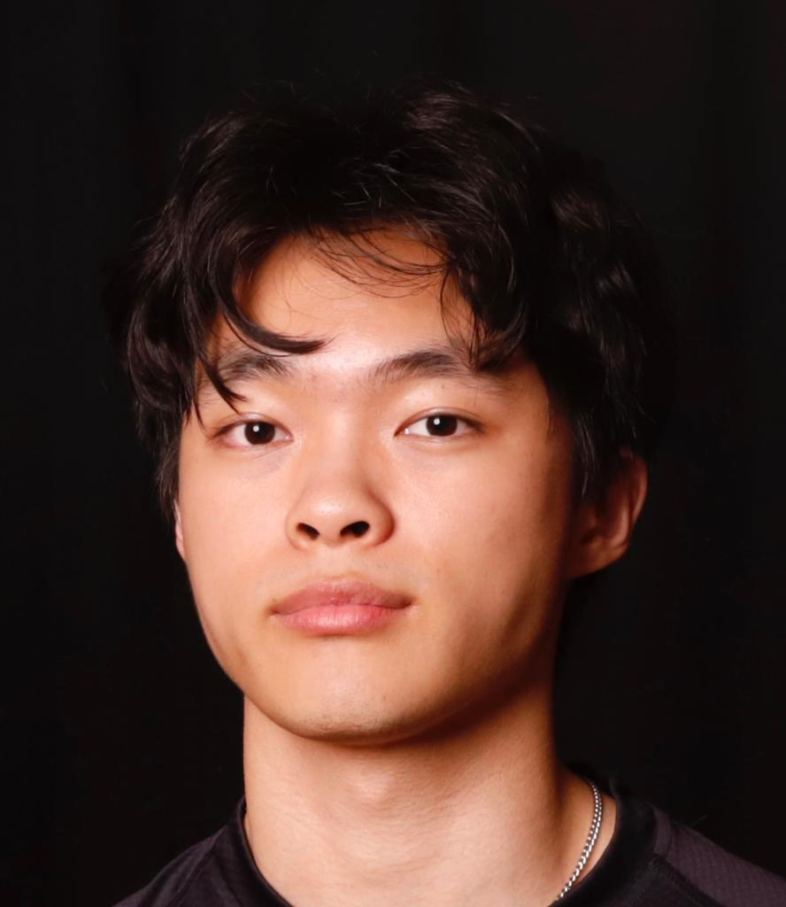
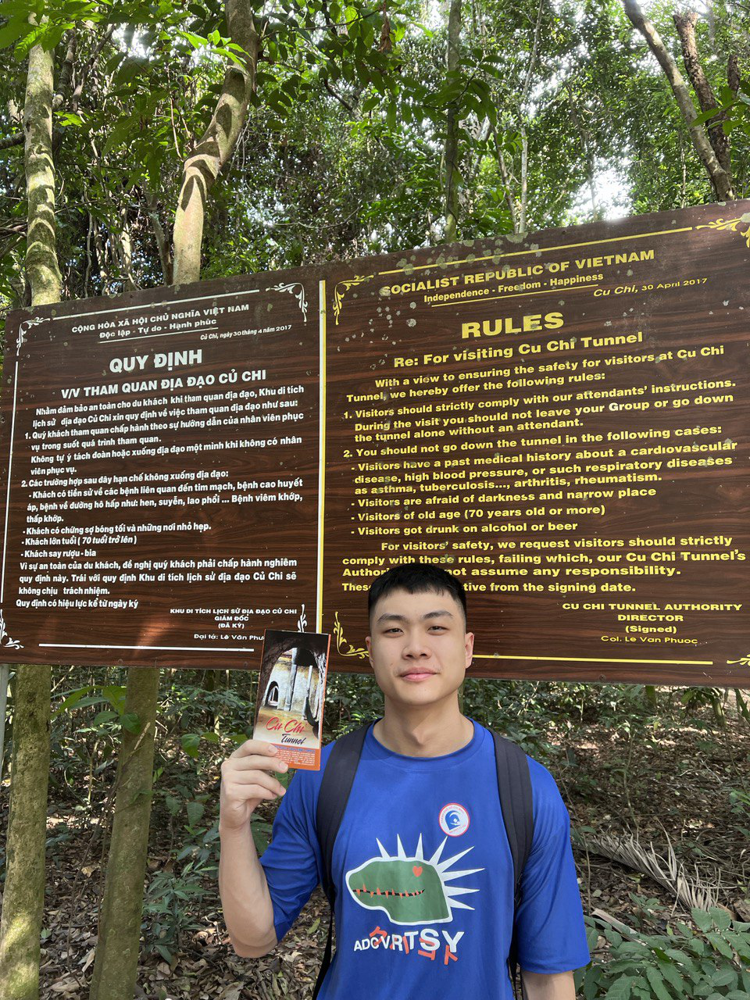
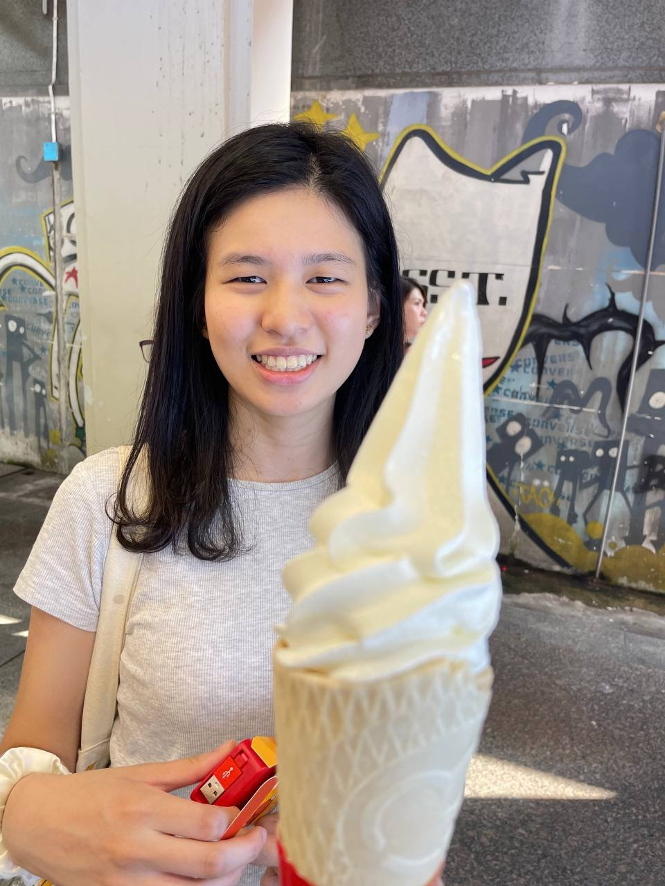
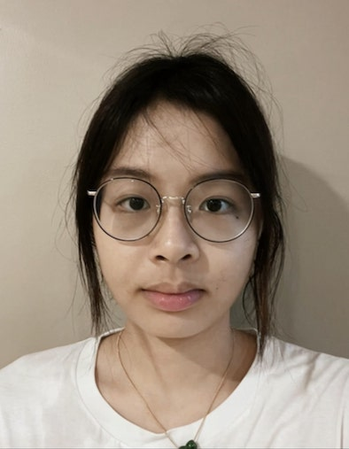

We are a team based in the [School of Computing, National University of Singapore](http://www.comp.nus.edu.sg).

You can reach us at the email `seer[at]comp.nus.edu.sg`

## Project team

### Samuel Mui

[[github](https://github.com/samuelmui8)]
[[portfolio](team/samuelmui.md)]

* Role: Developer
* Responsibilities: Testing

### Teo Kai Sheng

[[github](http://github.com/teoks0199)]
[[portfolio](team/teoks0199.md)]

* Role: Developer
* Responsibilities: UI

### Lim RuiZhi

[[github](https://github.com/Ruizhi2001)] 
[[portfolio](team/ruizhi.md)]

* Role: Developer
* Responsibilities: Data

### Beatrice Chen

[[github](http://github.com/johndoe)]
[[portfolio](team/beatrice.md)]

* Role: Developer
* Responsibilities: Dev Ops + Threading

### Du Kaixuan

[[github](https://github.com/jamesebond)]
[[portfolio](team/johndoe.md)]

* Role: Best Developer
* Responsibilities: Best UI
