* Table of Contents
{:toc}

--------------------------------------------------------------------------------------------------------------------

## **Acknowledgements**

* {list here sources of all reused/adapted ideas, code, documentation, and third-party libraries -- include links to the original source as well}

--------------------------------------------------------------------------------------------------------------------

## **Setting up, getting started**

Refer to the guide [_Setting up and getting started_](SettingUp.md).

--------------------------------------------------------------------------------------------------------------------

## **Design**

:bulb: **Tip:** The `.puml` files used to create diagrams in this document `docs/diagrams` folder. Refer to the [_PlantUML Tutorial_ at se-edu/guides](https://se-education.org/guides/tutorials/plantUml.html) to learn how to create and edit diagrams.

### Architecture

The ***Architecture Diagram*** given above explains the high-level design of the App.

Given below is a quick overview of main components and how they interact with each other.

**Main components of the architecture**

**`Main`** (consisting of classes [`Main`](https://github.com/AY2324S1-CS2103T-W10-4/tp/blob/master/src/main/java/seedu/address/Main.java) and [`MainApp`](https://github.com/AY2324S1-CS2103T-W10-4/tp/blob/master/src/main/java/seedu/address/Main.java)) is in charge of the app launch and shut down.
* At app launch, it initializes the other components in the correct sequence, and connects them up with each other.
* At shut down, it shuts down the other components and invokes cleanup methods where necessary.

The bulk of the app's work is done by the following four components:

* [**`UI`**](#ui-component): The UI of the App.
* [**`Logic`**](#logic-component): The command executor.
* [**`Model`**](#model-component): Holds the data of the App in memory.
* [**`Storage`**](#storage-component): Reads data from, and writes data to, the hard disk.

[**`Commons`**](#common-classes) represents a collection of classes used by multiple other components.

**How the architecture components interact with each other**

The *Sequence Diagram* below shows how the components interact with each other for the scenario where the user issues the command `delete-stall s/1`.

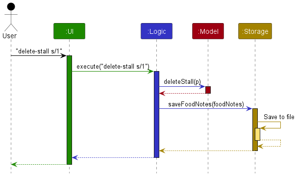

Each of the four main components (also shown in the diagram above),

* defines its *API* in an `interface` with the same name as the Component.
* implements its functionality using a concrete `{Component Name}Manager` class (which follows the corresponding API `interface` mentioned in the previous point.

For example, the `Logic` component defines its API in the `Logic.java` interface and implements its functionality using the `LogicManager.java` class which follows the `Logic` interface. Other components interact with a given component through its interface rather than the concrete class (reason: to prevent outside component's being coupled to the implementation of a component), as illustrated in the (partial) class diagram below.

The sections below give more details of each component.

### UI component

The **API** of this component is specified in [`Ui.java`](https://github.com/AY2324S1-CS2103T-W10-4/tp/blob/master/src/main/java/seedu/address/ui/Ui.java)

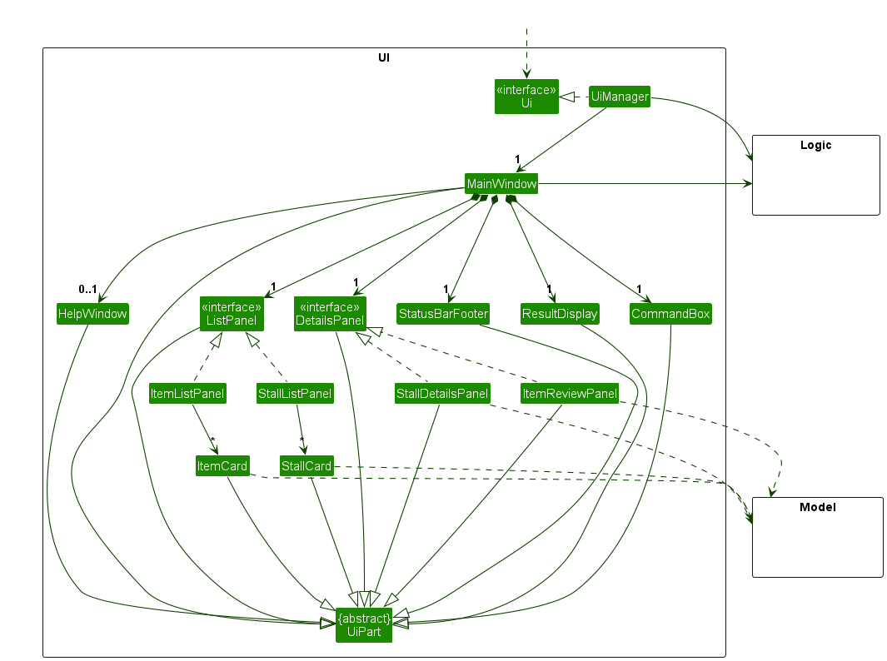

The UI consists of a `MainWindow` that is made up of parts e.g.`CommandBox`, `ResultDisplay`, `PersonListPanel`,
`StatusBarFooter` etc. All these, including the `MainWindow`, inherit from the abstract `UiPart` class which captures
the commonalities between classes that represent parts of the visible GUI.

The `UI` component uses the JavaFx UI framework. The layout of these UI parts are defined in matching `.fxml` files that
are in the `src/main/resources/view` folder. For example, the layout of the
[`MainWindow`](https://github.com/AY2324S1-CS2103T-W10-4/tp/blob/master/src/main/java/seedu/address/ui/MainWindow.java)
is specified in [`MainWindow.fxml`](https://github.com/AY2324S1-CS2103T-W10-4/tp/blob/master/src/main/resources/view/MainWindow.fxml)

The `UI` component,

* executes user commands using the `Logic` component.
* listens for changes to `Model` data so that the UI can be updated with the modified data.
* keeps a reference to the `Logic` component, because the `UI` relies on the `Logic` to execute commands.
* depends on some classes in the `Model` component, as it displays `Person` object residing in the `Model`.

### Logic component

**API** : [`Logic.java`](https://github.com/AY2324S1-CS2103T-W10-4/tp/blob/master/src/main/java/seedu/address/logic/Logic.java)

Here's a (partial) class diagram of the `Logic` component:

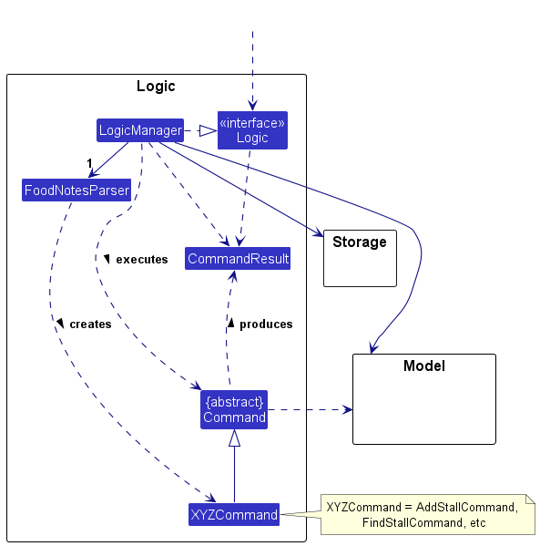

The sequence diagram below illustrates the interactions within the `Logic` component, taking `execute("delete-stall s/1")` API call as an example.

:information_source: **Note:** The lifeline for `DeleteCommandParser` should end at the destroy marker (X) but due to a limitation of PlantUML, the lifeline reaches the end of diagram.

How the `Logic` component works:

1. When `Logic` is called upon to execute a command, it is passed to an `AddressBookParser` object which in turn creates a parser that matches the command (e.g., `DeleteCommandParser`) and uses it to parse the command.
1. This results in a `Command` object (more precisely, an object of one of its subclasses e.g., `DeleteCommand`) which is executed by the `LogicManager`.
1. The command can communicate with the `Model` when it is executed (e.g. to delete a stall).
1. The result of the command execution is encapsulated as a `CommandResult` object which is returned back from `Logic`.

Here are the other classes in `Logic` (omitted from the class diagram above) that are used for parsing a user command:

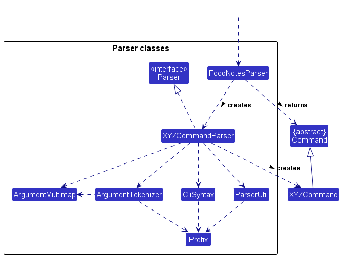

How the parsing works:
* When called upon to parse a user command, the `AddressBookParser` class creates an `XYZCommandParser` (`XYZ` is a placeholder for the specific command name e.g., `AddCommandParser`) which uses the other classes shown above to parse the user command and create a `XYZCommand` object (e.g., `AddCommand`) which the `AddressBookParser` returns back as a `Command` object.
* All `XYZCommandParser` classes (e.g., `AddCommandParser`, `DeleteCommandParser`, ...) inherit from the `Parser` interface so that they can be treated similarly where possible e.g, during testing.

### Model component
**API** : [`Model.java`](https://github.com/AY2324S1-CS2103T-W10-4/tp/blob/master/src/main/java/seedu/address/model/Model.java)

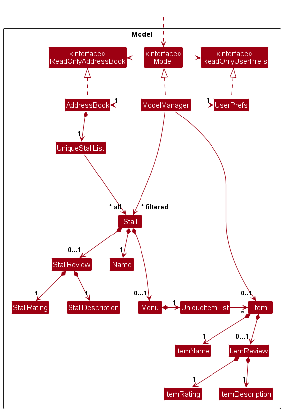

The `Model` component,

* stores the address book data i.e., all `Stall` objects (which are contained in a `UniqueStallList` object).
* stores the currently 'selected' `Stall` objects (e.g., results of a search query) as a separate _filtered_ list which is exposed to outsiders as an unmodifiable `ObservableList<Stall>` that can be 'observed' e.g. the UI can be bound to this list so that the UI automatically updates when the data in the list change.
* stores a `UserPref` object that represents the user’s preferences. This is exposed to the outside as a `ReadOnlyUserPref` objects.
* does not depend on any of the other three components (as the `Model` represents data entities of the domain, they should make sense on their own without depending on other components)

### Storage component

**API** : [`Storage.java`](https://github.com/AY2324S1-CS2103T-W10-4/tp/blob/master/src/main/java/seedu/address/storage/Storage.java)

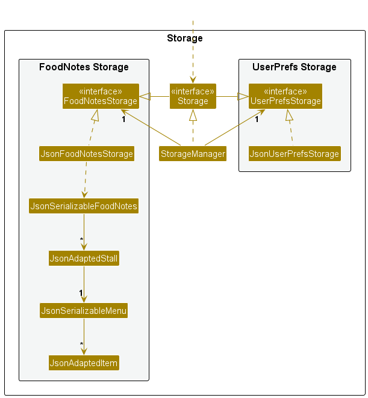

The `Storage` component,
* can save both address book data and user preference data in JSON format, and read them back into corresponding objects.
* inherits from both `AddressBookStorage` and `UserPrefStorage`, which means it can be treated as either one (if only the functionality of only one is needed).
* depends on some classes in the `Model` component (because the `Storage` component's job is to save/retrieve objects that belong to the `Model`)

### Common classes

Classes used by multiple components are in the `seedu.address.commons` package.

--------------------------------------------------------------------------------------------------------------------

## **Implementation**

This section describes some noteworthy details on how certain features are implemented.

### Sort stalls by price feature

#### Implementation

The proposed sort stalls price functionality is facilitated by `SortStallsPriceCommand`.

The following sequence diagram shows how the sort operation works:

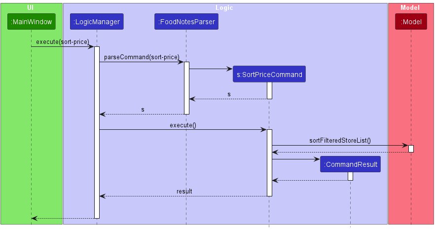

`sortStallPrice` is a method in `ModelManager` that sorts the filtered stall list by price.
It calls `sortByPrice` in `UniqueStallList` which sorts the list of stalls by price which makes use of
`StallPriceComparator` to compare the prices of the stalls.

#### Design considerations:
**Aspect: How sort stalls price executes:**

* **Alternative 1 (Current choice):** Saves the sorted list of stalls in FoodNotes.
    * Pros: User does not need to re-sort list after every command.
    * Cons: Original ordering of stalls will be lost.

* **Alternative 2:** Displays the sorted list of stalls only.
    * Pros: Easy to implement.
    * Cons: User needs to re-sort stalls by price after every command if they want to view the sorted list.

### Add item and delete item feature

#### Implementation:

The add-item/delete-item mechanism is facilitated by `ModelManager`. It extends `Model`, stored internally as an `UniqueItemLis`.

These operations are exposed in the `Model` interface as `Model#addItem()` and `Model#deleteItem()` respectively with the addition of getters and setters.

The following sequence diagram shows how the add-item operation works:

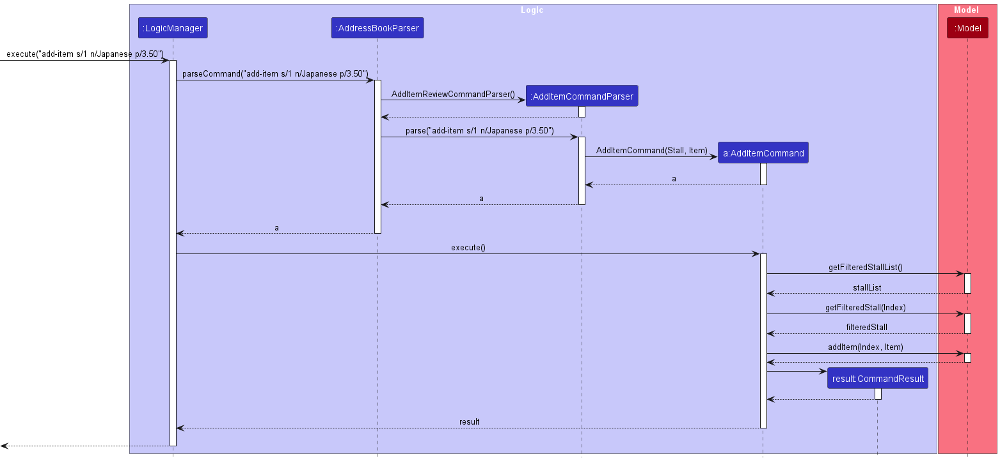

The `delete-item` command does the opposite — it calls `Model#deleteItem()`, which deletes the specified item from its specified stall.

:information_source: **Note:** If the `stallIndex` or `itemIndex` is at index out of range of `filteredStallList.size() - 1` or , then there are no stalls to delete the item from.

The following activity diagram summarizes what happens when a user executes a new command:

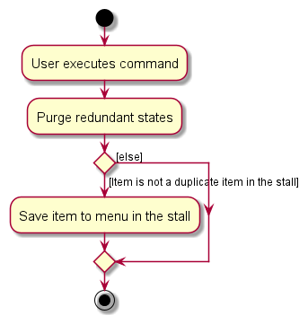

#### Design considerations:

**Aspect: Number of fields needed to be entered by the user:**

* **Alternative 1 (current choice): Only require them to enter the stall they belong to and the name of the item**
    * Pros: The review field is optional and users can add items without a review.
    * Cons: Causes some fields to be null when initialised (e.g. `rating` and `review`) and more code is needed to implement.

* **Alternative 2: Require all fields required to be present when adding an item:**
    * Pros: Less code is needed to implement.
    * Cons: Users are restricted to only adding items when they have a review.

### Find-by-item feature

#### Implementation

The find item feature is facilitated by `FindItemCommand` that extends `Command`.

The following sequence diagram shows how the find item operation works:

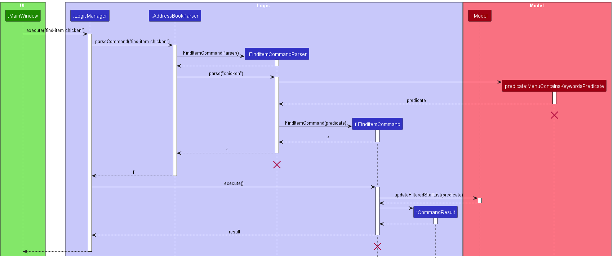

The `MenuContainsKeywordsPredicate` is used to filter the list of stalls in FoodNotes. It is created with a list of keywords, and it checks if the menu items of a stall contains any of the keywords.
#### Design considerations:

**Aspect: Number of fields needed to be entered by the user:**

* **Alternative 1 (current choice):** Allows the user to search for stalls containing any of the keywords.
    * Pros: Users can search for multiple items at once, for example they can look for stalls that sell either "chicken" or "apple".
    * Cons: More complicated to implement.

* **Alternative 2:** Only allow the user to search for one keyword at a time.
    * Pros: Easy to implement as parsing one keyword is more simple than parsing multiple keywords.
    * Cons: Less flexible for the user.

### Add stall review feature

#### Implementation

The add stall review feature is facilitated by `AddStallReviewCommand` that extends `Command`.

The following sequence diagram shows how the add stall review operation works:

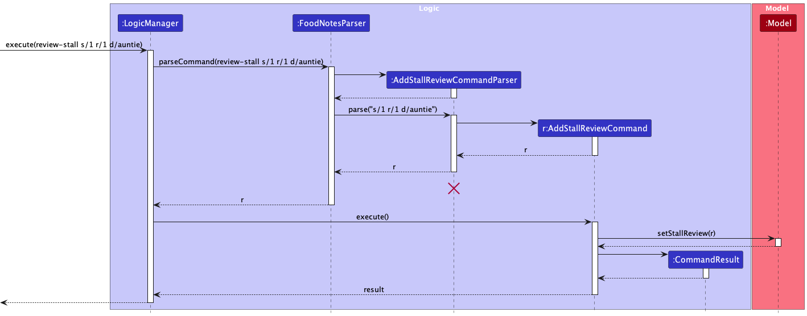

#### Design considerations:

**Aspect: Number of fields needed to be entered by the user:**

* **Alternative 1 (current choice):** Allows the user to enter the stall's review, rating and description.
    * Pros: Users can enter multiple fields for the stall's review at once, do not have to add individual fields one by one.
    * Cons: Some users may feel that it is too troublesome to enter multiple fields at once.

* **Alternative 2:** Only allow the user to enter one field at a time.
    * Pros: Easy to implement as parsing one keyword is more simple than parsing multiple keywords.
    * Cons: More troublesome for the user as they have to enter multiple fields one by one.

--------------------------------------------------------------------------------------------------------------------
### View stall feature

#### Implementation

The view stall feature is facilitated by `ViewStallCommand` that extends `Command`.

The following sequence diagram shows how the find item operation works:

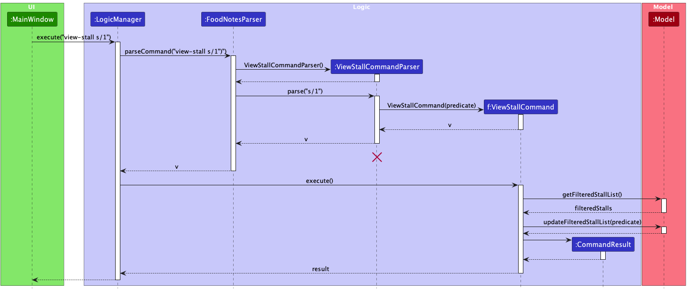

The `updateFilteredStallListPredicate` is used to filter the list of stalls in FoodNotes. It is created with a the name of the stall entered by the user.

#### Design considerations:
**Aspect: Details displayed:**

* **Alternative 1 (current choice):** Details of the stalls (menu items and review) are only displayed when the view-stall command is entered. Otherwise, only the average price of the stall and star rating will be shown.
  * Pros: The interface will not be cluttered with information. The menu items and detailed reviews will only be shown when users want to find out more.
  * Cons: More cards and fxml panels will be needed, making it more complicated to implement.

* **Alternative 2:** All the information is displayed in the list of stalls.
  * Pros: Easy to implement as only one card and fxml stallPanel is required.
  * Cons: The interface will be cluttered with information and when there is many menu items, the users will have to scroll within each card, making it less user-friendly.

--------------------------------------------------------------------------------------------------------------------

## **Documentation, logging, testing, configuration, dev-ops**

* [Documentation guide](Documentation.md)
* [Testing guide](Testing.md)
* [Logging guide](Logging.md)
* [Configuration guide](Configuration.md)
* [DevOps guide](DevOps.md)

--------------------------------------------------------------------------------------------------------------------
## **Planned Enhancements**

### Make it clearer to the user that the list of stalls is filtered.
**Current Implementation:**
* **Current Issue:** Users can view a filtered list of stalls when they use commands such as `find-by-location` and `find-by-item`. In the case where there is only 1 stall in the list and the user performs a stall deletion, the user will see a page showing an empty list of stall. This might cause confusion as the user might think that all the stalls are deleted.
* **Example:**
1. User enters `find-by-location Deck`.
2. A list of stalls containing one stall is displayed.
3. User enters `view-stall s/1` to view the details of the stall.
4. User enters `delete-stall s/1` to remove the stall from FoodNotes.
5. List of stalls with no stalls is displayed.
6. The list of stalls is still filtered by location which is the Deck, but it might give the wrong impression that there are no more stalls in FoodNotes.

**Proposed Solution:**

We propose to enhance the filter stalls commands to display the list of stalls with a short description saying that the list is filtered.
1. Edit the card that displays the list of stalls.

--------------------------------------------------------------------------------------------------------------------

## **Appendix: Requirements**

### Product scope

**Target user profile**:

* Student foodie from NUS
* Has the need to remember reviews of many food stores and food items
* Has a tight budget
* Prefers desktop apps over other types
* Can type fast
* Prefers typing to mouse interactions
* Is comfortable using CLI apps

**Value proposition**: Manage and view food reviews faster than a typical mouse/GUI driven app

### User stories

Priorities: High (must have) - `* * *`, Medium (nice to have) - `* *`, Low (unlikely to have) - `*`

| Priority | As a...                        | I want to...                                   | So that I can...                                                  |
|----------|--------------------------------|------------------------------------------------|-------------------------------------------------------------------|
| `* * *`  | new user                       | add reviews to stalls                          | remember what I think about the food stalls                       |
| `* * *`  | new user                       | delete reviews from stalls                     | delete the review of the food stall if I reviewed the wrong stall |
| `* * *`  | new user                       | add stalls                                     | keep track of the food stalls I have tried                        |
| `* * *`  | new user                       | delete stalls                                  | remove stalls if they no longer exist                             |
| `* * *`  | new user                       | add menu items                                 | remember what food items a stall sells                            |
| `* * *`  | new user                       | delete menu items                              | remove food items that a stall no longer sells                    |
| `* * *`  | new user                       | view stalls                                    | see the list of stalls I have saved                               |
| `* * *`  | new user                       | view menu items of a stall                     | see what the stall sells                                          |
| `* * *`  | new user                       | view a stall                                   | see the details of the stall such as its location and review      |
| `* * *`  | new user                       | view an item                                   | see the details of the item such as its price and review          |
| `* * *`  | new user                       | view the user guide easily                     | learn more about the product when needed                          |
| `* * *`  | new user                       | add reviews to menu items                      | so that I can remember what I think about the item                |
| `* * *`  | new user                       | delete reviews from menu items                 | delete review of the menu item if I reviewed the wrong item       |
| `* *`    | new user                       | edit stall details                             | change the details of a stall if I made a mistake                 |
| `* *`    | new user                       | edit item details                              | change the details of an item if I made a mistake                 |
| `* *`    | new user                       | edit stall reviews                             | change my review of a stall if I made a mistake                   |
| `* *`    | new user                       | edit item reviews                              | change my review of an item if I made a mistake                   |
| `* *`    | budget conscious student       | sort the stalls by average price of menu       | find the cheapest stalls to dine at easily                        |
| `* *`    | experienced user               | sort the stalls by rating                      | find the stalls I love the most                                   |
| `* *`    | experienced user               | sort the stalls by location                    | see the stalls at each location clearly                           |
| `* *`    | experienced user               | filter the stalls by location                  | find the stalls at a specific location that I plan to visit       |
| `* *`    | experienced user               | filter the stalls by name                      | find the specific stalls that I wish to visit                     |
| `* *`    | experienced user               | filter the stalls by menu item                 | find the stalls that sell a dish I wish to eat                    |
| `*`      | experienced user               | save my favorite stalls                        | easily find my favourite stalls                                   |
| `*`      | vegetarian student             | filter stalls to only show vegetarian choices  | find vegetarian food that I can eat                               |
| `*`      | student with allergies         | filter stalls by allergen information          | find food that I can eat safely                                   |
| `*`      | health-conscious student       | see nutritional information for menu items     | make informed choices about what I eat                            |
| `*`      | student who often studies late | filter stalls by opening hours                 | quickly find food places to go for late-night suppers             |
| `*`      | Muslim student                 | filter food options to only show halal choices | find halal food that I can eat                                    |
| `*`      | student athlete                | find stalls with high protein meals            | support my training needs                                         |

### Use cases

(For all use cases below, the **System** is `FoodNotes` and the **Actor** is the `user`, unless specified otherwise)

**Use case: UC01 - Add a stall**

**MSS**

1. User requests to add a stall to FoodNotes.
2. FoodNotes adds the stall to the list of stalls.

    Use case ends.

**Extensions**

* 1a. The stall name or location is not specified.

    * 1a1. FoodNotes shows an error message.

      Use case resumes at step 1.
  
* 1b. The stall name or location is invalid.

    * 1b1. FoodNotes shows an error message.

      Use case resumes at step 1.

**Use case: UC02 - Add a review to a stall**

**MSS**

1. User requests to add a review to a stall
2. FoodNotes adds a review to the specified stall

    Use case ends.

**Extensions**

* 1a. The list of stalls is empty.
  * 1a1. FoodNotes shows an error message.
  * 1a2. <ins>User adds a stall (UC01).</ins>

    Use case resumes at step 1.

* 1b. The given stall index, star rating or description is invalid.

    * 1b1. FoodNotes shows an error message.

      Use case resumes at step 1.

* 1c. The stall index, star rating or description is not specified

    * 1c1. FoodNotes shows an error message.

      Use case resumes at step 1.

**Use case: UC03 - Delete a review from stall**

**MSS**

1. User requests to delete the review from a stall.
2. FoodNotes deletes the review from the specified stall.

    Use case ends.

**Extensions**

* 1a. The given stall index is invalid.

  * 1a1. FoodNotes shows an error message.

    Use case resumes at step 1.

* 1b. The stall has no review.

  * 1b1. FoodNotes shows an error message.

    Use case ends.

**Use case: UC04 - Add an item to a stall**

**MSS**

1. User requests to add an item to a stall.
2. FoodNotes adds the item to the specified stall.

    Use case ends.

**Extensions**

* 1a. The list of stalls is empty.
  * 1a1. FoodNotes shows an error message.
  * 1a2. <ins>User adds a stall (UC01).</ins>

    Use case resumes at step 1.

* 1b. The given stall index, item name or price is invalid.
    * 1b1. FoodNotes shows an error message.

      Use case resumes at step 1.

* 1c. The stall index, item name or price is not specified.
    * 1c1. FoodNotes shows an error message.

      Use case resumes at step 1.

**Use case: UC05 - Delete an item from a stall**

**MSS**

1. User requests to delete an item from a specific stall.
2. FoodNotes deletes the specified item from the specified stall.

    Use case ends.

**Extensions**

* 1a. The given stall index or item index is invalid.
  * 1a1. FoodNotes shows an error message.

  Use case resumes at step 1.

* 1b. The stall index or item index is not specified.
    * 1b1. FoodNotes shows an error message.

    Use case resumes at step 1.

**Use case: UC06 - Add a review to an item**

**MSS**

1. User requests to add a review to an item in a specific stall.
2. FoodNotes adds the review to the specified item in the specified stall.

    Use case ends.

**Extensions**

* 1a. The given stall index, item index, rating or description is invalid.

    * 1a1. FoodNotes shows an error message.

      Use case resumes at step 1.

* 1b. The stall index, item index, rating or description is not specified.

    * 1b1. FoodNotes shows an error message.

      Use case resumes at step 1.

### Non-Functional Requirements

1.  Should work on any _mainstream OS_ as long as it has Java `11` or above installed.
2.  Should be able to hold up to 100 stalls without a noticeable sluggishness in performance for typical usage.
3.  A user with above average typing speed for regular English text (i.e. not code, not system admin commands) should be able to accomplish most of the tasks faster using commands than using the mouse.
4. A user should not experience any noticeable sluggishness in performance when sorting or searching for stalls.
5. The data of the application is stored locally.

*{More to be added}*

### Glossary

* **Mainstream OS**: Windows, Linux, Unix, OS-X
* **Card**: Used to display information including texts and images, in a structured and organised way.
* **GUI**: Graphical User Interface
* **Jar file**: A Java Archive file used to distribute and run Java applications
* **Result Display**: The component in the main window that displays the success/error messages to users whenever a command is entered.
* **Left Display**: The component in the main window that displays the list of stalls in FoodNotes. When filtering commands such as `find-by-location` are used, the _Left Display_ will display the filtered list of stalls.
* **Right Display**: The component in the main window that displays the list of valid commands to be used in FoodNotes. When `view-stall` or `view-item` commands are used, the _Right Display_ will display the details of the stall/menu item.

--------------------------------------------------------------------------------------------------------------------

## **Appendix: Instructions for manual testing**

Given below are instructions to test the app manually.

:information_source: **Note:** These instructions only provide a starting point for testers to work on;
testers are expected to do more *exploratory* testing.

### Launch and shutdown

1. Initial launch

   1. Download the jar file and copy into an empty folder

   2. Double-click the jar file Expected: Shows the GUI with a set of sample stalls. The window size may not be optimal.

2. Saving window preferences

   1. Resize the window to an optimal size. Move the window to a different location. Close the window.

   2. Re-launch the app by double-clicking the jar file. 
       Expected: The most recent window size and location is retained.
   

:bulb: **Tip:** 

If double-clicking `FoodNotes.jar` does not work,

1. Search for "Command Prompt" or "Terminal" on your computer.
2. Navigate to the location where `FoodNotes.jar` is saved via the terminal.
3. Run the following in the terminal: `java -jar FoodNotes.jar`.

### Adding a stall

1. Adding a stall to FoodNotes.

   1. Prerequisites: None.

   2. Test case: `add-stall n/Pasta Express l/Deck` 
      Expected: Pasta Express located in Deck is added to the list. The _Result Display_ shows a success message. The list of the stalls on the _Left Display_ is updated.

   3. Test case: `add-stall n/Indian Shop` 
      Expected: No stall is added. Error details shown in the _Result Display_.

   4. Other incorrect add commands to try: `add-stall`, `add-stall n/abc l/Deck l/Frontier`, `...`  
      Expected: Similar to previous.

### Deleting a stall

1. Deleting a stall while all stalls are being shown

   1. Prerequisites: Multiple stalls in the list. List all stalls using the `list` command.

   2. Test case: `delete-stall s/1` 
      Expected: First stall is deleted from the list. Details of the deleted stall shown in the _Result Display_. List of stalls in the _Left Display_ is updated.

   3. Test case: `delete-stall s/0` 
      Expected: No stall is deleted. Error details shown in the _Result Display_.

   4. Other incorrect delete commands to try: `delete-stall`, `delete-stall s/x`, `...` (where x is larger than the list size) 
      Expected: Similar to previous.

### Viewing a stall

1. Viewing a stall while all stalls are being shown

   1. Prerequisites: Multiple stalls in the list. List all stalls using the `list` command.

   2. Test case: `view-stall s/1` 
      Expected: _Result Display_ shows a success message. Details of the stall is shown on the _Left Display_.

   3. Test case: `view-stall s/0` 
      Expected: No stall is shown. Error details shown in the _Result Display_.

   4. Other incorrect view commands to try: `view-stall`, `view-stall s/x`, `...` (where x is larger than the list size) 
      Expected: Similar to previous.

### Reviewing a stall

1. Reviewing a stall while the stall details are being shown.

   1. Prerequisites: At least one stall in the list. View the stall using the `view-stall` command.

   2. Test case: `review-stall s/1 r/4 d/The food here is really good` 
      Expected: The _Result Display_ shows a success message. The stall details in the _Right Display_ is updated with the star ratings and review descriptions.

   3. Test case: `review-stall s/1 r/4` 
      Expected: No stall description is added. Error details shown in the _Result Display_.

   4. Other incorrect review commands to try: `review-stall s/1 r/3 r/5`(duplicate prefix), `review-stall s/1 d/xyz`, `...` (missing rating) 
      Expected: Similar to previous.

### Adding a menu item to a stall

1. Adding a menu item while the stall details are shown

   1. Prerequisites: At least one stall in the list. View the stall details with the `view-stall` command. The menu items of the stall is displayed in the left panel.

   2. Test case: `add-item s/1 n/Pork Chop p/4.50` 
      Expected: _Result Display_ shows a success message. The menu item is added the list of menu items in the _Left Display_.

   3. Test case: `add-item s/1 n/PorkChop p/$4.00` 
      Expected: No item is added. Error details shown in the _Result Display_.

   4. Other incorrect add commands to try: `add-item`, `add-item s/x n/x p/y`, `...` (where x is larger than the list size, y is not a positive double with 2 decimal places in the specified format) 
      Expected: Similar to previous.

### Deleting a menu item from a stall

1. Deleting a menu item while the stall details are shown

   1. Prerequisites: At least one stall in the list. At least one item in that stall. View the stall details with the `view-stall` command. The menu items of the stall is displayed in the left panel.

   2. Test case: `delete-item s/1 i/1` 
      Expected: First item is deleted from the list. Details of the deleted item shown in the _Result Display_. List of items in the _Left Display_ is updated.

   3. Test case: `delete-item s/0 i/1` 
      Expected: No item is deleted. Error details shown in the _Result Display_.

   4. Other incorrect delete commands to try: `delete-item`, `delete-item s/1 i/0`, `delete-item s/x i/x`, `...` (where x is larger than the list size) 
      Expected: Similar to previous.

### Viewing a menu item to a stall

1. Viewing a menu item while the stall details are shown

   1. Prerequisites: At least one stall in the list. At least one item in that stall. View the stall details with the `view-stall` command. The menu items of the stall is displayed in the left panel.

   2. Test case: `view-item s/1` 
      Expected: _Result Display_ shows a success message. Details of the item are shown on the _Right Display_.

   3. Test case: `view-item s/0` 
      Expected: No item details are shown. Error details shown in the _Result Display_.

   4. Other incorrect delete commands to try: `view-item`, `view-item s/x`, `...` (where x is larger than the list size) 
      Expected: Similar to previous.

### Sorting the stalls by location

1. Sorting the stalls by locations while all stalls are shown.

   1. Prerequisites: Multiple stalls in the list. List all stalls using the `list` command.

   2. Test case: `sort-stalls-location` 
      Expected: _Result Display_ shows a success message. The list displayed in the _Left Display_ is sorted by alphabetical order based on their location.

### Sorting the stalls by rating

1. Sorting the stalls by rating while all stalls are shown

   1. Prerequisites: Multiple stalls in the list. List all stalls using the `list` command.

   2. Test case: `sort-stalls-rating` 
      Expected: _Result Display_ shows a success message. The list displayed in the _Left Display_ is sorted in descending order based on ratings.

### Sorting the stalls by price

1. Sorting the stalls by price while all stalls are shown

   1. Prerequisites: Multiple stalls in the list. List all stalls using the `list` command.

   2. Test case: `sort-stalls-price` 
      Expected: _Result Display_ shows a success message. The list displayed in the _Left Display_ is sorted in ascending order based on average price.

### Finding stalls by stall name

1. Finding the stalls that contain the keyword in the name.

   1. Prerequisites: Multiple stalls in the list. List all stalls using the `list` command.

   2. Test case: `find-by-name japanese` 
      Expected: _Result Display_ shows a success message. The list displayed in the _Left Display_ contains all the stalls with the name containing the keyword 'japanese' (case-insensitive).

   3. Test case: `find-by-name japanese western` 
       Expected: _Result Display_ shows a success message. The list displayed in the _Left Display_ contains all the stalls with the name containing the keyword 'japanese' or 'western' (case-insensitive).

   4. Other incorrect find commands to try: `find-by-name`
      Expected: No stall is found. Error details shown in the _Result Display_.

### Finding stalls by stall location

1. Finding the stalls that contain the keyword in the location.

   1. Prerequisites: Multiple stalls in the list. List all stalls using the `list` command.

   2. Test case: `find-by-location utown` 
      Expected: _Result Display_ shows a success message. The list displayed in the _Left Display_ contains all the stalls with the location containing the keyword 'utown' (case-insensitive).

   3. Test case: `find-by-location utown frontier` 
      Expected: _Result Display_ shows a success message. The list displayed in the _Left Display_ contains all the stalls with the location containing the keyword 'utown' or 'frontier' (case-insensitive).

   4. Other incorrect find commands to try: `find-by-location`
      Expected: No stall is found. Error details shown in the _Result Display_.

### Finding stalls by item name

1. Finding the stalls that contain the keyword in their menu items.

   1. Prerequisites: Multiple stalls in the list. List all stalls using the `list` command.

   2. Test case: `find-by-item chicken` 
   Expected: _Result Display_ shows a success message. The list displayed in the _Left Display_ contains all the stalls whose menu items contain the keyword 'chicken' (case-insensitive).

   3. Test case: `find-by-item chicken pork` 
     Expected: _Result Display_ shows a success message. The list displayed in the _Left Display_ contains all the stalls whose menu items contain the keyword 'chicken' or 'pork' (case-insensitive).

   4. Other incorrect find commands to try: `find-by-item`
     Expected: No stall is found. Error details shown in the _Result Display_.

### Help
1. Test case: `help` 
   Expected: The help window pops out and shows a general help message.

### Exit the application
1. Test case: `exit` 
   Expected: FoodNotes application closes

### Saving data

1. Dealing with corrupted data files

   1. To simulate a corrupted file, you can edit `addressbook.json` directly and introduce some texts that does not follow the correct format.
   2. In the event of a corrupted data file, FoodNotes will automatically create a new data file with the no data. The user can then add new stalls to the data file.
   3. If the user wishes to have the preloaded data, they can delete the corrupted data file and upon launch, FoodNotes will automatically create a new data file with the preloaded data.

2. Dealing with missing data files
   1. To simulate a missing data file, you can delete `addressbook.json` from the data folder.
   2. In the event of a missing data file, FoodNotes will automatically create a new data file with the preloaded data.
   
