## Introduction

Welcome to the User Guide of **FoodNotes**!

Ever find yourself forgetting the delightful dishes you savored? Hungry for a way to recall your favorite food experiences? FoodNotes has the solution.

FoodNotes is a quick, simple and beautiful food diary made specifically for you, NUS student foodies. With FoodNotes, you can add stalls that you want to keep track of and manage your reviews for them.

This application is optimised for use via a Command Line Interface (CLI) this means that you operate the application by typing commands into a _Command Box_. If you are fast at typing, you can manage your food reviews faster than other Graphical User Interface (GUI) applications; GUI applications allow users to interact with the application through graphical icons such as buttons.
FoodNotes is available for the Linux, Unix, Windows and Mac OS operating systems.



## About the user guide
### Navigating the user guide

**If you are a first time user:**

1. The [Quick Start](#quick-start) section provides instructions for you on how to get started.
2. Once you have set up FoodNotes, you can check out the [Layout Screen](#terminology-related-to-the-graphical-user-interface-gui) section to get familiar
with the different components of FoodNotes. To learn the basics of using FoodNotes, head over to the [Features](#features) section.

**If you are an experienced user:**

You can refer to the [Command summary](#command-summary) section for an overview of FoodNotes' commands.

### Reading the User Guide
Before you jump into the next section, take a moment to familiarise yourself with the technical terms, symbols, and syntax used throughout this document. This subsection contains all the essential information you need to understand the content better.

### Terminology related to the Graphical User Interface (GUI)
The following figure shows the GUI of FoodNotes. It is annotated with the name of the GUI components.

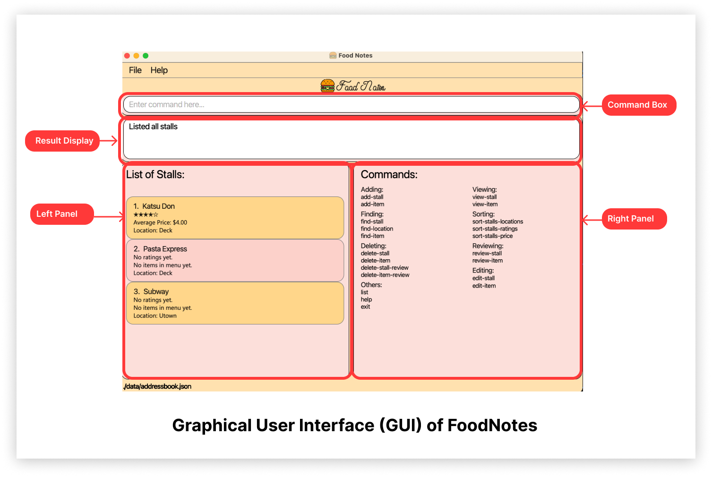

What the main components of the GUI do:

* _Right and Left Display_: This is where FoodNotes displays the information of the page that you are viewing.

* _Result Display_: This is where FoodNotes displays guiding messages.

* _Command Box_: This is where you type your commands.

### Icons

This section will run you through the icons used in this guide.

| Icon                | Meaning                                                          |
|---------------------|------------------------------------------------------------------|
| :information_source: | An information icon indicates that the enclosed text are notes regarding this section. |
| :warning:           | A warning sign indicates that the enclosed text is important, and usually entails details about potential errors. |
|  :bulb:             | A light bulb indicates that the enclosed text is a tip.|

### Command Syntax and Usage
Since FoodNotes is a CLI application, knowing how to use commands is very important. The following subsection will teach you how to read and use commands in FoodNotes. All commands in FoodNotes follow similar formats as described below and examples will be provided to help you understand their usage. Examples of commands and their formats will be written in code-blocks.

The table below explains some important technical terms. An example will be provided to help you visualize these terms.

|**Technical Term** | **Meaning**                                                                                                                |
|---------------------|----------------------------------------------------------------------------------------------------------------------------|
| Command word | The first word of a command. It determines the action that FoodNotes should perform.                                       |
| Parameter | The word or group of words following the command word. They are values given to a command to perform the specified action. |
| Prefix | A prefix is a word that precedes a parameter. It is used to identify the type of parameter that is being input.            |

### Input parameters

This section provides a summary of the parameters used when inputting commands into the application.

| Prefix | Parameter           | Meaning                                | Input                                       |
|--------|---------------------|----------------------------------------|---------------------------------------------|
| `n/`   | `STALL_NAME`        | Name of the stall                      | Non-empty string                            |
| `s/`   | `STALL_INDEX`       | Index of the stall in the list         | Integer from 1 to 2147483647 (inclusive)    |
| `l/`   | `STALL_LOCATION`    | Location of the stall                  | Non-empty string                            |
| `n/`   | `ITEM_NAME`         | Name of the item                       | Non-empty string                            |
| `i/`   | `ITEM_INDEX`        | Index of the item in the menu          | Integer from 1 to 2147483647 (inclusive)    |
| `p/`   | `ITEM_PRICE`        | Price of the item                      | Non-negative number with 2 decimal places   |
| `r/`   | `STALL_RATING`      | Rating of the stall                    | Integer from 1 to 5 (inclusive)             |
| `r/`   | `ITEM_RATING`       | Rating of the item                     | Integer from 1 to 5 (inclusive)             |
| `d/`   | `STALL_DESCRIPTION` | Descriptive review for the stall       | Non-empty string                            |
| `d/`   | `ITEM_DESCRIPTION`  | Descriptive review for the item        | Non-empty string                            |
| N/A    | `NAME_KEYWORD`      | Keyword of the stall name              | Non-empty string                            |
| N/A    | `LOCATION_KEYWORD`  | Keyword of the stall location          | Non-empty string                            |
| N/A    | `ITEM_KEYWORD`      | Keyword of the menu items in the stall | Non-empty string                            |

--------------------------------------------------------------------------------------------------------------------

## Quick Start

1. Ensure you have Java `11` or above installed in your Computer.

2. Download the latest `FoodNotes.jar` from [here](https://github.com/AY2324S1-CS2103T-W10-4/tp/releases/download/v1.3.1/FoodNotes.jar).

3. Copy the file to the folder you want to use as the _home folder_ for your FoodNotes.

4. Open a command terminal, `cd` into the folder you put the jar file in, and use the `java -jar foodnotes.jar` command to run the application. 
   A GUI similar to the below should appear in a few seconds. Note how the app contains some sample data. 
   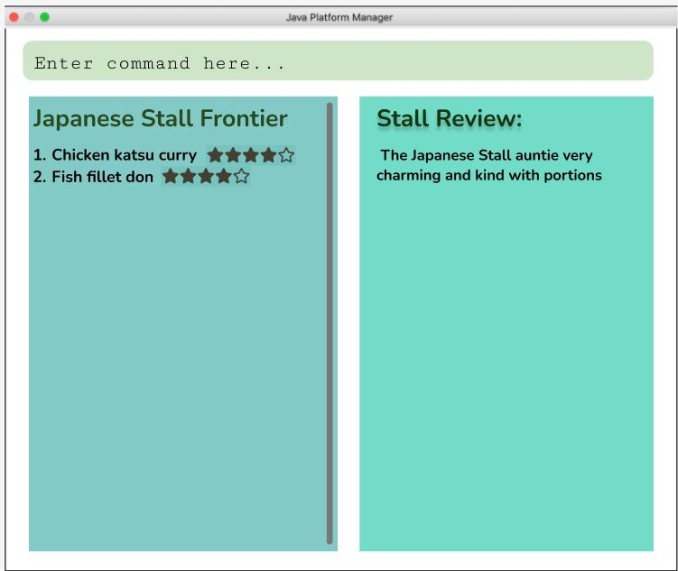

5. Type the command in the _Command Box_ and press Enter to execute it. e.g. typing `help` and pressing Enter will open the help window. 
   Some example commands you can try:

   * `add-stall n/Chicken Rice l/Deck` : Adds a stall named `Chicken Rice` located at `Deck` to the list of stalls.

   * `view-stall s/1` : Shows the 1st stall shown in the current list.

   * `list` : Lists all stalls.

6. Refer to the [Features](#features) below for details of each command.

:bulb: **Tip:** 

* If double-clicking `FoodNotes.jar` does not work,

    1. Search for "Command Prompt" or "Terminal" on your computer.
    2. Navigate to the location where `FoodNotes.jar` is saved via the terminal. (_Unsure how to navigate?_ You can try running this in your terminal: `cd Downloads`.)
    3. Run the following in the terminal: `java -jar FoodNotes.jar`.

--------------------------------------------------------------------------------------------------------------------

## Features
This section shares with you on how to use each feature in detail.

### General Features

The commands in this section allow you to perform operations on the entire system. They include:
- Viewing help
- Exiting from the application
- Clearing the FoodNotes database

#### Viewing help : `help`

You can use this command to view the online user guide, which contains information about all the instructions in FoodNotes.

:information_source: Ensure that you have a stable internet connection and have a web browser on your computer in order to access the user guide.

**Format:**

`help`

Requesting for help:

1. Type `help` into the _Command Box_ and press `Enter` to execute.
2. A new window will appear as shown below. Click on the `Copy URL` button to copy the URL containing the FoodNotes user guide.
   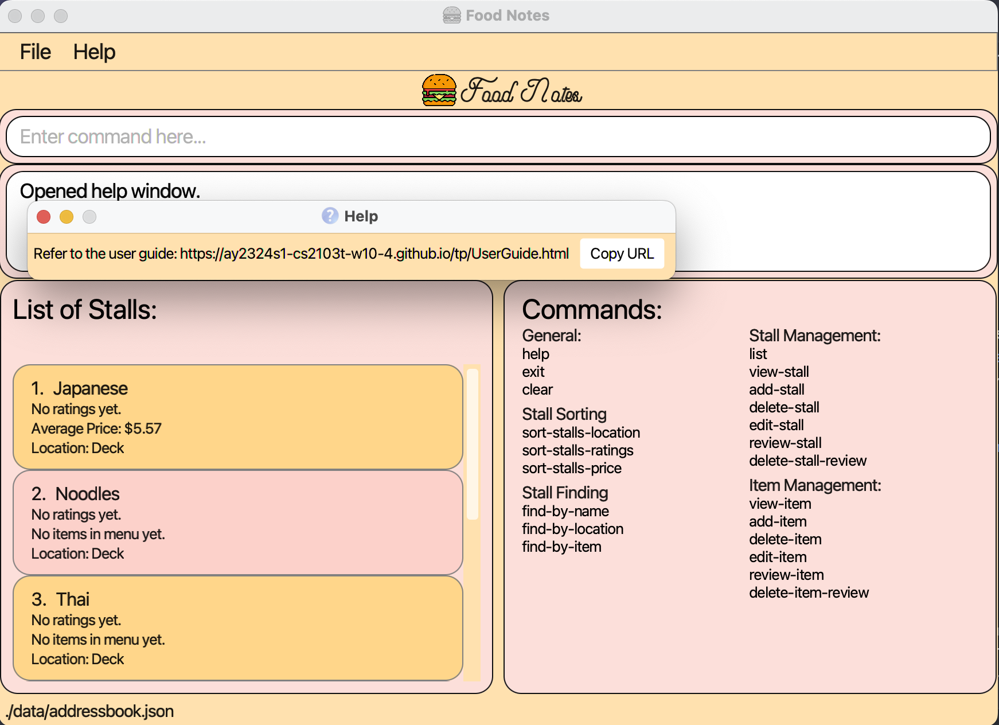
3. Open your preferred web browser on your computer and paste the link into the address bar.
4. Press `Enter` to load the website.

Outcome:

1. Your browser will now show the user guide of FoodNotes.
2. You can now access information about all commands in FoodNotes via the browser.

#### Exiting from the application: `exit`

You can use this command to exit FoodNotes.

:information_source: This command will exit the application immediately. All data is saved automatically and will be reloaded upon restart of the application.

**Format:**

`exit`

Exiting the application:

Type `exit` into the _Command Box_ and press `Enter` to execute.

Outcome:

The FoodNotes application window is now closed.

#### Clearing the FoodNotes database: `clear`

You can use this command to clear the database in FoodNotes.

:warning: This command will permanently delete all data stored in FoodNotes. You should make a backup of `addressbook.json` if you still want to keep your old data.

**Format:**

`clear`

**Example:**

In this example, you want to clear all data stored in FoodNotes.

Exiting the application:

Type `clear` into the _Command Box_ and press `Enter` to execute.

Outcome:

The FoodNotes database is now empty.
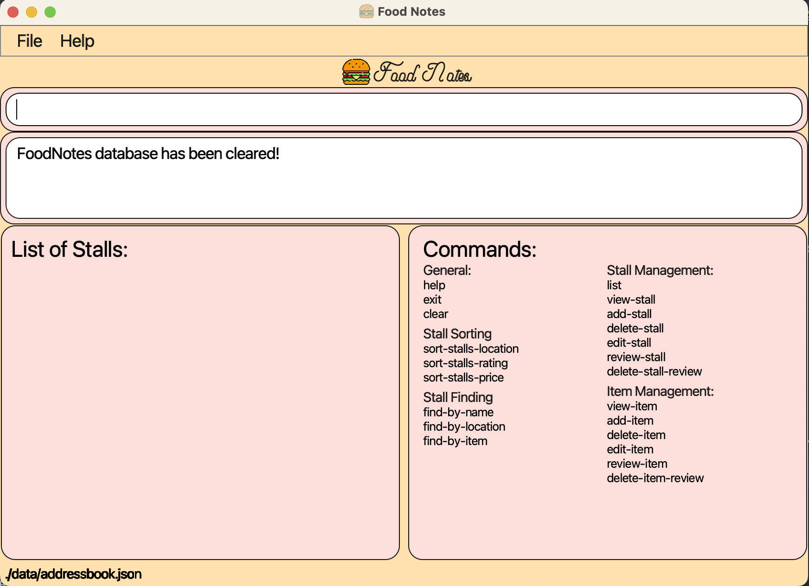

----
### Stall Management

These features allow you to manage information about the stalls in FoodNotes. You can record and perform the following actions:
- Listing all stalls
- Viewing a stall
- Adding a stall
- Deleting a stall
- Editing a stall
- Reviewing a stall
- Deleting a stall review

#### Listing all stalls : `list`

You can use this command to view the list of all the stalls in FoodNotes.

**Format:**

`list`

Listing all your stalls:
Type `list` into the _Command Box_ and press `Enter` to execute.

Outcome:

1. The Result Display will show a success message.
1. You can now see all your stalls in the *List Panel*.

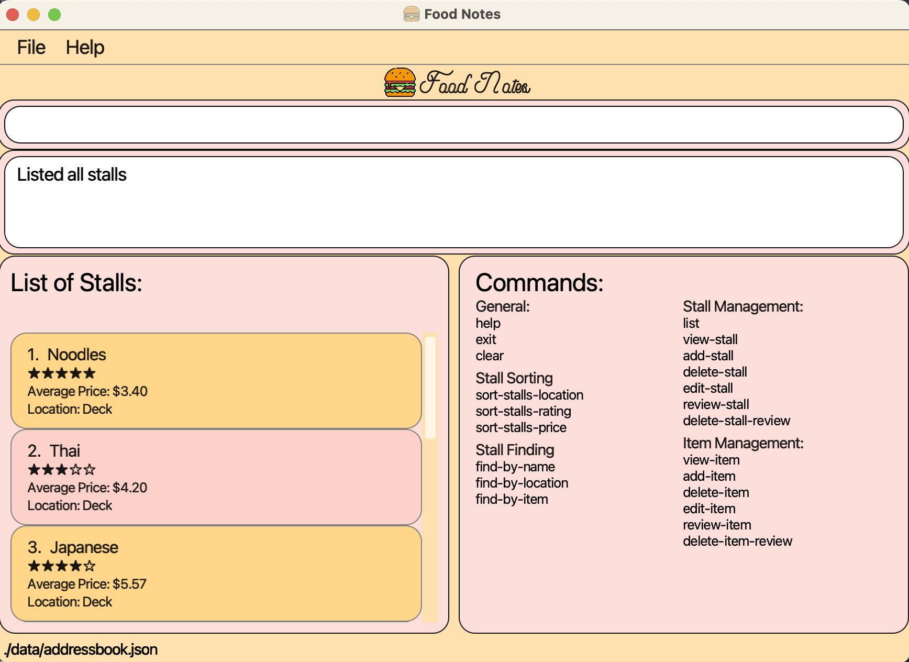

#### Viewing a stall : `view-stall`

You can use this command to view details from a specific stall from FoodNotes, which includes the menu items and review of the stall.

**Format:**

`view-stall s/STALL_INDEX`

**Example:**

You wish to view the details of the first stall in the list.

Viewing a specific stall:

1. Type `view-stall s/1` into the _Command Box_.
2. Press `Enter` to execute.

Outcome:

1. The _Result Display_ will show a success message.
2. You can now see the details of the first stall.

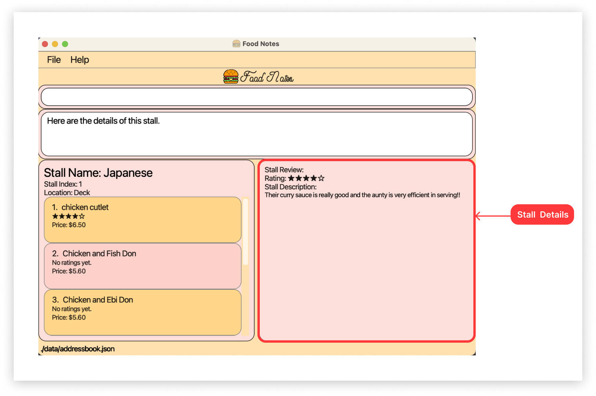

#### Adding a stall : `add-stall`

You can use this command to add a new stall to FoodNotes.

**Format:**

`add-stall n/STALL_NAME l/LOCATION`

**Example:**
You just visited the newly opened Subway at Utown and wish to add it to FoodNotes.

Adding a new stall:

1. Type `add-stall n/Subway l/Utown` into the _Command Box_.
1. Press `Enter` to execute.

Outcome:

1. The _Result Display_ will show a success message.
1. You have now added a new stall with the specified name and location.

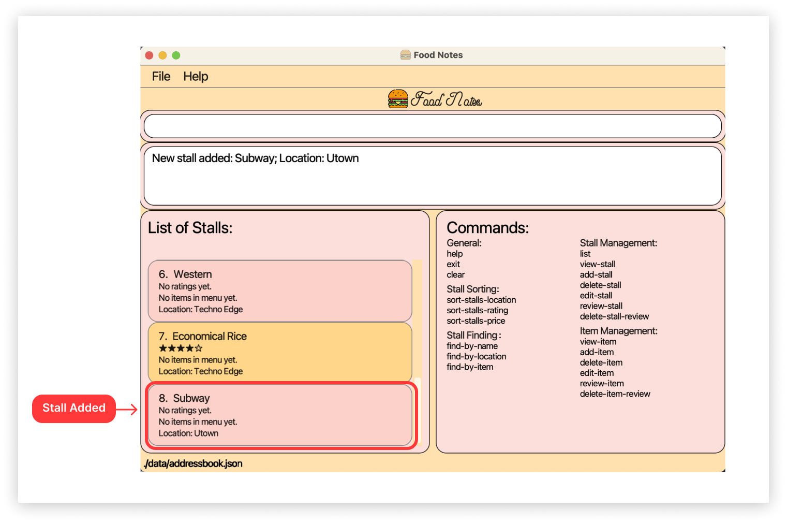

:warning: **Take note:** 

* You are not allowed to add duplicate stalls of the same name and location (case-insensitive) to FoodNotes.

#### Deleting a stall : `delete-stall`

The stall no longer exists? You can use this command to delete a stall from FoodNotes, making sure that your food diary is always up to date!

**Format:**

`delete-stall s/STALL_INDEX`

**Example:**
You realised a stall has closed down and you want to delete it from FoodNotes.

Deleting the third stall from the list:

1. Type `delete-stall s/3` into the _Command Box_.
1. Press `Enter` to execute.

Outcome:

1. The _Result Display_ will show a success message.
1. You have now deleted the third stall from the list.

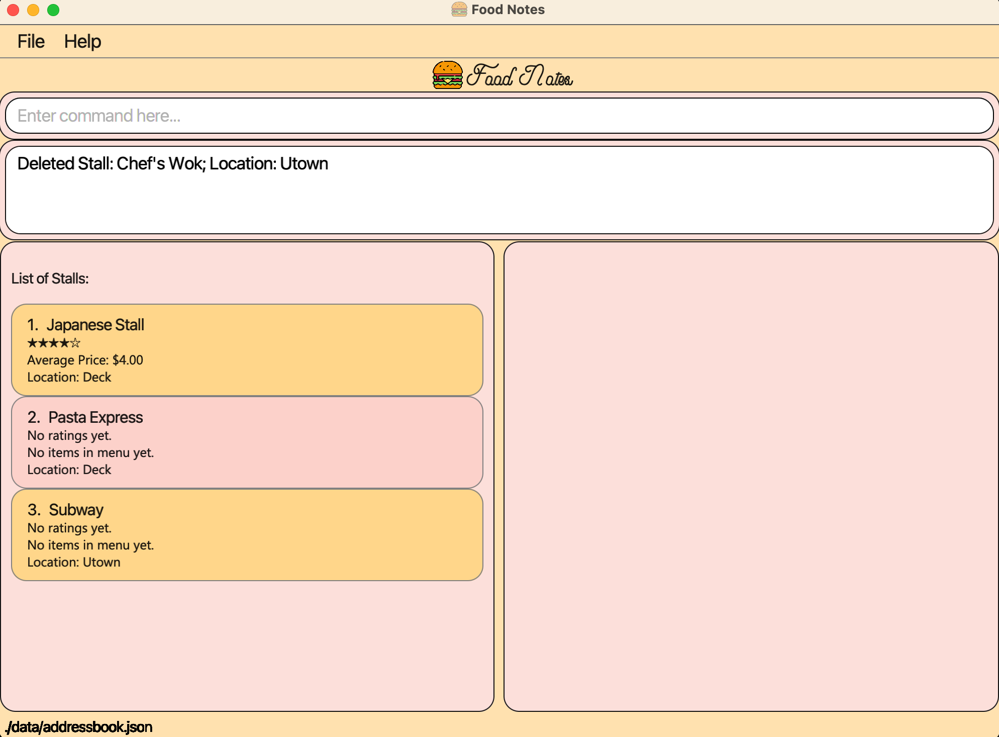

#### Editing a stall : `edit-stall`

You can use this command to edit an existing stall, and update its name, location. If the stall has a review,
you may edit its rating and/or description.

:information_source: You must specify at least one of the optional parameters, and you can only edit ratings and descriptions if the stall already has an existing review.

**Format:**

`edit-stall s/STALL_INDEX [n/STALL_NAME] [l/LOCATION] [r/STALL_RATING] [d/STALL_DESCRIPTION] `

**Example:**
You wish to change the location of the seventh stall in the list, as the stall has relocated from Utown to Frontier.

Editing the seventh stall from the list:

1. Type `edit-stall s/7 l/Frontier` into the *Command Box*.
1. Press `Enter` to execute.

Outcome:

1. The *Result Display* will show a success message.
1. You have now edited the seventh stall from the list, and the list of stalls will be updated.

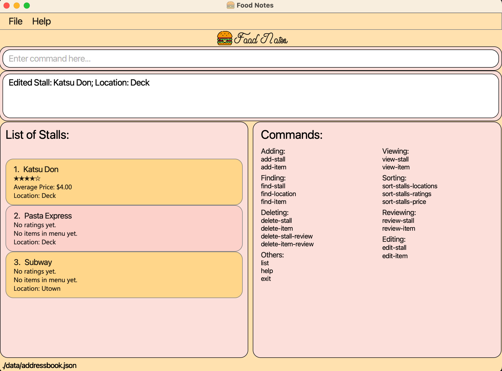

#### Reviewing a stall : `review-stall`

You can use this command to review an existing stall, and add your own star rating and even some text descriptions for the stall.

**Format:**

`review-stall s/STALL_INDEX r/STALL_RATING d/STALL_DESCRIPTION`

**Example:**
You want to give the second stall in the list a five-star rating.

Reviewing the stall:

1. Type `review-stall s/2 r/5 d/Best chicken rice with generous portion` into the _Command Box_.
1. Press `Enter` to execute.

Outcome:

1. The _Result Display_ will show a success message.
1. You have now reviewed the specific stall from the list, and the star ratings will be reflected.

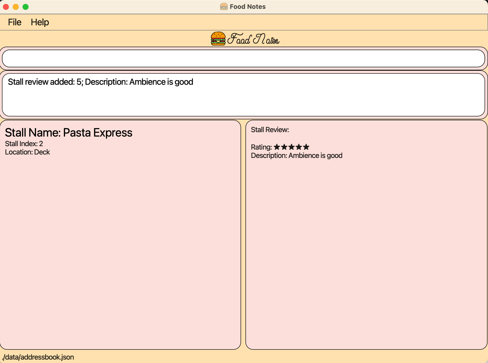

#### Deleting a stall review: `delete-stall-review`

Added a review to the wrong stall? You can use this command to delete a review of an existing stall.

**Format:**

`delete-stall-review s/STALL_INDEX`

**Example:**
You decide to delete the review for the second stall in the list.

Deleting the stall review:

1. Type `delete-stall-review s/2` into the _Command Box_.
1. Press `Enter` to execute.

Outcome:

1. The _Result Display_ will show a success message.
1. You have now deleted the review of the specified stall from the list, and the list will be updated.

---------------------------------------------------------------------------------------------------------------------
### Stall Sorting
This feature allows you to sort the stalls by their location, rating and price, so you can now easily find the stalls based on these criterias.

#### Sort stalls by location: `sort-stalls-location`

You can use this command to sort the stalls by their location in alphabetical order.

**Format:**
`sort-stalls-location`

**Example:**
You wish to sort the stalls by their location in alphabetical order.

Sorting the stalls by location:

1. Type `sort-stalls-location` in the _Command Box_.
2. press `Enter` to execute.

Outcome:

1. The _Result Display_ will display a success message.
2. You will now see that the stalls are sorted by location in alphabetical order in the _Left Display_, as illustrated
   in the screenshot below.

#### Sort stalls by rating: `sort-stalls-rating`

You can use this command to sort the stalls by their rating in descending order, so the stall with the highest rating will appear right at the top!

**Format:**
`sort-stalls-rating`

**Example:**
You wish to view the stalls' rating in descending order.

Sorting stalls by rating:

1. Type `sort-stalls-rating` in the _Command Box_.
2. press `Enter` to execute.

Outcome:

1. The _Result Display_ will display a success message.
2. You will now see that the stalls are sorted by rating in descending order in the _Left Display_, as illustrated
   in the screenshot below.

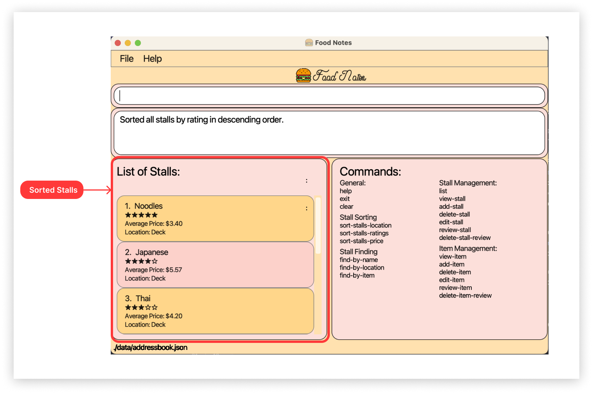

#### Sort stalls by price: `sort-stalls-price`

You can use this command to sort the stalls by the average price of its menu items in ascending order, and the stall with the cheapest food options can be easily retrieved!

**Format:**
`sort-stalls-price`

**Example:**
You wish to view the stalls' average price in ascending order.

Sorting stalls by price:

1. Type `sort-stalls-price` in the _Command Box_.
2. press `Enter` to execute.

Outcome:

1. The _Result Display_ will display a success message.
2. You will now see that the stalls are sorted by average price in ascending order in the _Left Display_, as illustrated
   in the screenshot below.

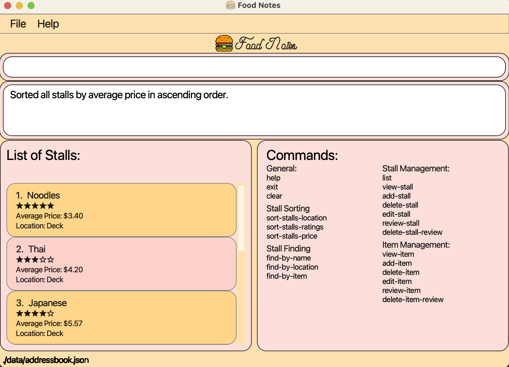

--------------------------------------------------------------------------------------------------------------------

### Stall Finding

This feature allows you to find stalls by their name, location and menu items. Whichever small detail you can remember, you can easily find that stall.

#### Finding stalls by name: `find-by-name`
The command is a powerful tool for quickly locating specific food stalls based on their names. Even if you can only remember part of the stall name, this command can help you narrow down your choices effectively.
You need to type in the entire word instead of part of the word for it to find the stall.

**Format:** `find-by-name NAME_KEYWORD`

**Example:**
You wish to find stalls that have 'Japanese' or 'Western' or 'Noodles' in their names.

Finding stalls by name:

1. Type `find-by-name Japanese Western Noodles` in the _Command Box_.
2. Press `Enter` to execute.

Outcome:

1. The _Result Display_ will display a success message.
2. You will now see the matching stalls in the _Left Display_, as illustrated in the screenshot below.

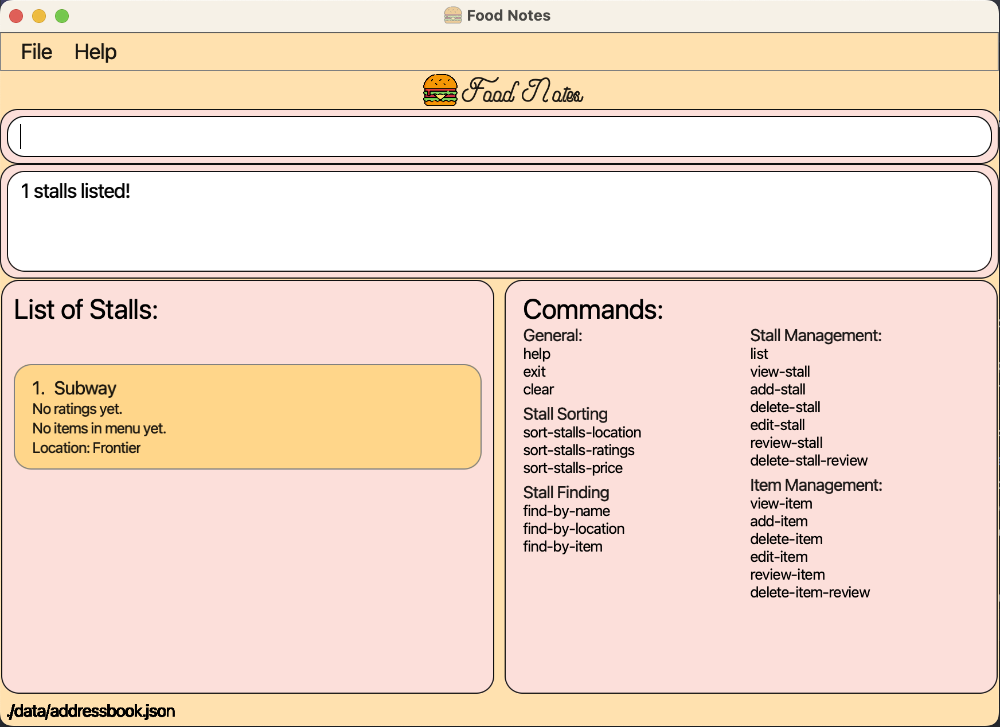

:bulb: **Tip:** 

* You can enter more than one keyword, separated by a space, and all the stalls containing any of the keywords will be listed!

---
#### Find stalls by location: `find-by-location`
The command is a powerful tool for quickly locating specific food stalls based on their locations. If you want to find the nearest food options, this command can help you narrow down your choices effectively.

**Format:** `find-by-location LOCATION_KEYWORD`

**Example:**
You wish to find stalls that are located at the Deck.

finding stalls by location:

1. Type `find-by-location deck` in the _Command Box_.
2. Press `Enter` to execute.

Outcome:

1. The _Result Display_ will display a success message.
2. You will now see the matching stalls in the _Left Display_, as illustrated in the screenshot below.

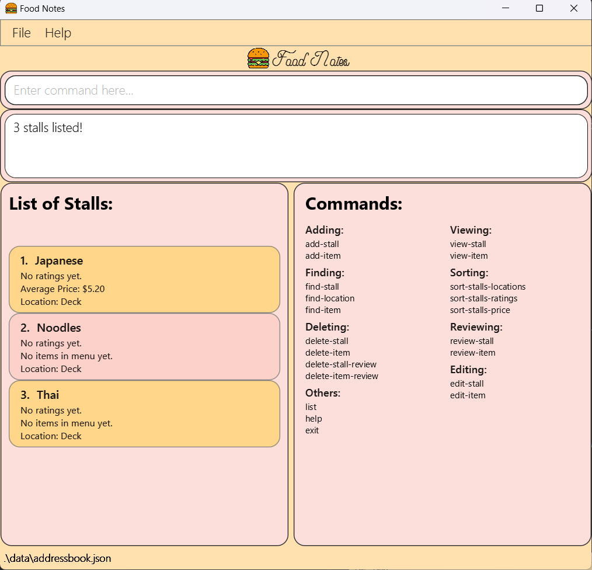

:bulb: **Tip:** 

* You can enter more than one keyword, separated by a space, and all the stalls containing any of the keywords will be listed!

---
#### Find stalls by menu items: `find-by-item`
The command is a powerful tool for quickly locating specific food stalls based on the items on their menu. If you are craving for a specific dish, this command can help you narrow down your choices effectively.

**Format:** `find-by-item ITEM_KEYWORD`

**Example:**
You wish to find stalls that sells chicken rice.

finding stalls by menu items:

1. Type `find-by-item chicken rice` in the _Command Box_.
2. Press `Enter` to execute.

Outcome:

1. The _Result Display_ will display a success message.
2. You will now see the matching stalls in the _Left Display_, as illustrated in the screenshot below.
3. When you enter `view-stall s/1`, you will be able to see 'chicken rice' in the list of menu items.

<table>
  <tr>
    <td>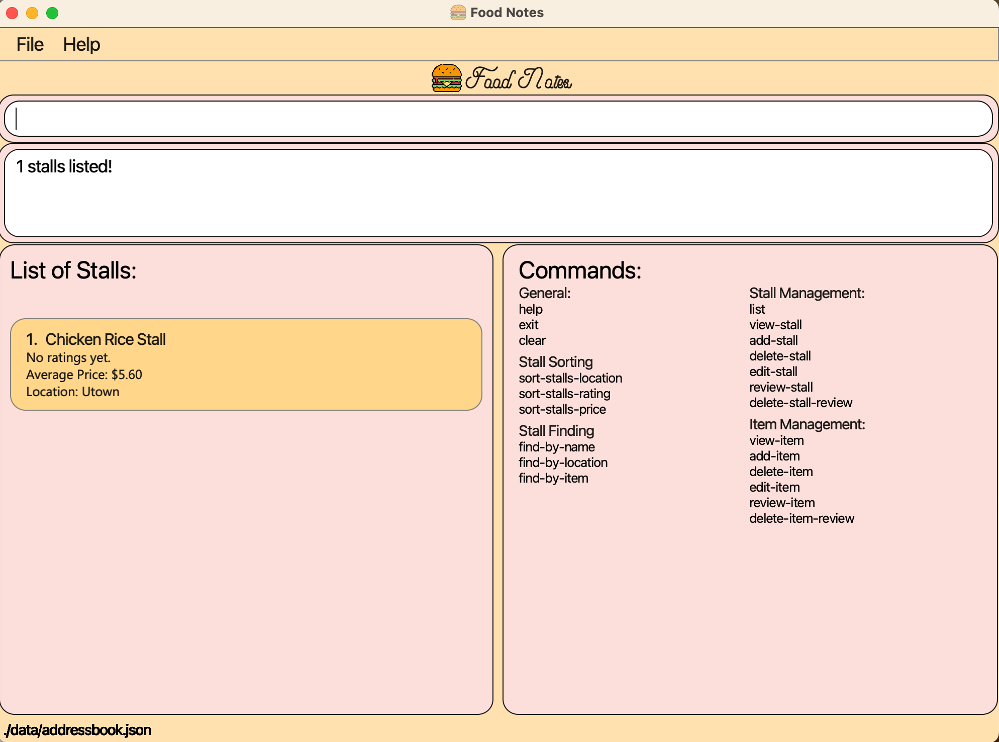</td>
    <td>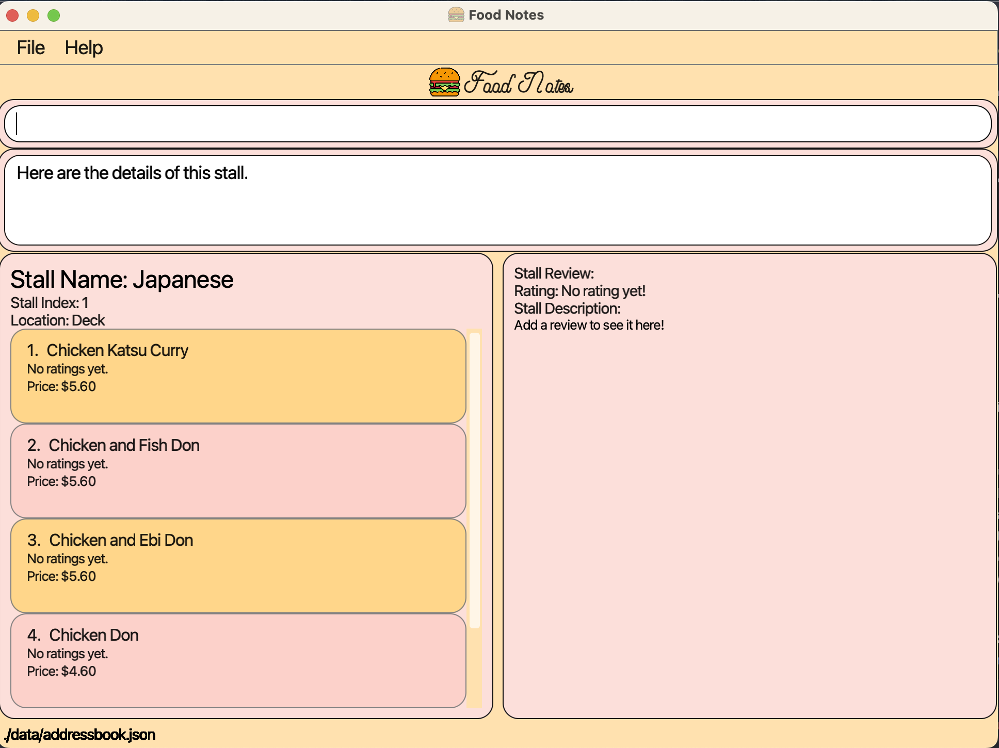</td>
  </tr>
</table>

:bulb: **Tip:** 

* You can enter more than one keyword, separated by a space, and all the stalls containing any of the keywords will be listed!

-----

### Item Management
This feature allows you to manage information about the items in **FoodNotes**. You can record and perform the following actions:

- Viewing an item: `view-item`
- Adding an item: `add-item`
- Deleting an item: `delete-item`
- Editing an item: `edit-item`
- Reviewing an item: `review-item`
- Deleting an item review: `delete-item-review`

#### Viewing an item : `view-item`

You can use this command to view details of a specific item from a specific stall in FoodNotes,
which includes the price, rating and description of the item.

**Format:**

`view-item s/STALL_INDEX i/ITEM_INDEX`

**Example:**
You want to view the first item in the first stall.

Viewing the first item from the first stall:

1. Type `view-item s/1 i/1` into the _Command Box_.
1. Press `Enter` to execute.

Outcome:

1. The _Result Display_ will show a success message.
1. You can now see the details of the specific item you entered in.

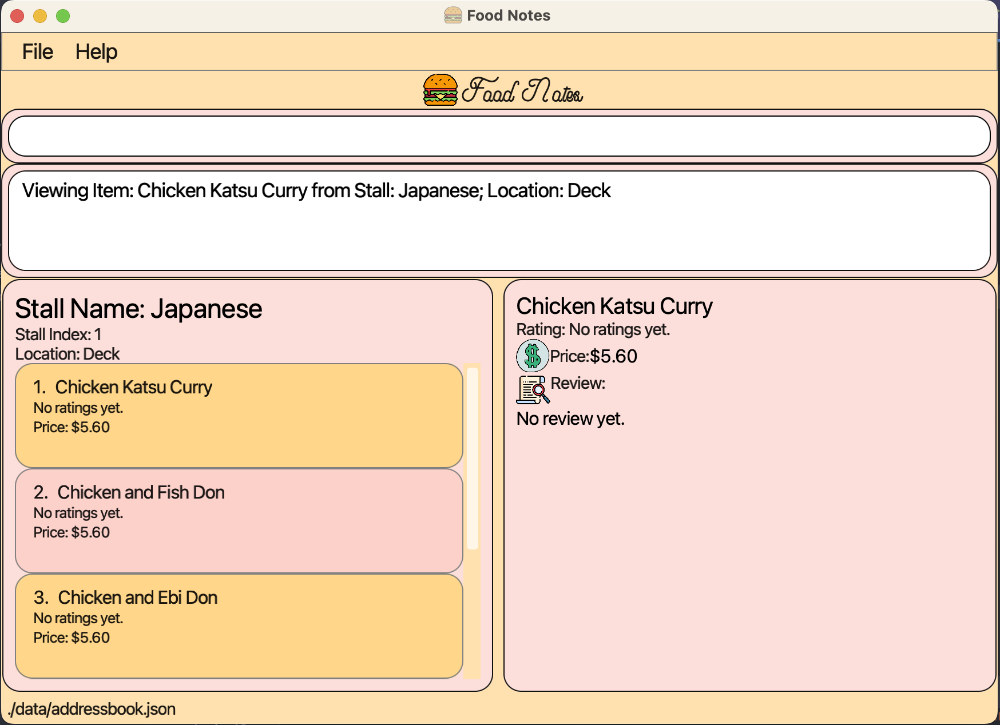

#### Adding an item : `add-item`

Tried a new menu item from the stall? You can use this command to add this new item to FoodNotes.

**Format:**

`add-item s/STALL_INDEX n/ITEM_NAME p/ITEM_PRICE`

**Example:**
You wish to add a new item name 'Pork Chop' with the price of $5.50 to the first stall in the list

Adding a new item to the first stall:

1. Type `add-item s/1 n/Pork Chop p/5.50` into the _Command Box_.
1. Press `Enter` to execute.

Outcome:

1. The _Result Display_ will show a success message.
1. You have now added a new item with the specified name and price.

:warning: **Take note:** 

* You are not allowed to add duplicate items of the same name (case-insensitive) to a stall.

#### Deleting an item : `delete-item`

You can use this command to delete an item from the database.

**Format:**

`delete-item s/STALL_INDEX i/ITEM_INDEX`

**Example:**
You wish to delete the third item from the first stall.

Deleting the third item from the menu:

1. Type `delete-item s/1 i/2` into the _Command Box_.
1. Press `Enter` to execute.

Outcome:

1. The _Result Display_ will show a success message.
1. You have now deleted the second menu item of the first stall.

#### Editing an item : `edit-item`

You can use this command to edit an existing item, and update its name, location, rating and/or description.

:information_source: You must specify at least one of the optional parameters, and you can only edit ratings and descriptions if the item already has an existing review.

**Format:**

`edit-item s/STALL_INDEX i/ITEM_INDEX [n/ITEM_NAME] [p/ITEM_PRICE] [r/ITEM_RATING] [d/ITEM_DESCRIPTION] `

**Example:**
You wish to edit the price of the sixth item in the first stall, as there is a change in price to Pork Chop that you have added previously.

Editing the sixth item from the first stall:

1. Type `edit-item s/1 i/1 n/Chicken Cutlet p/4.00` into the _Command Box_.
1. Press `Enter` to execute.

Outcome:

1. The _Result Display_ will show a success message.
1. You have now edited the first menu item of the first stall.

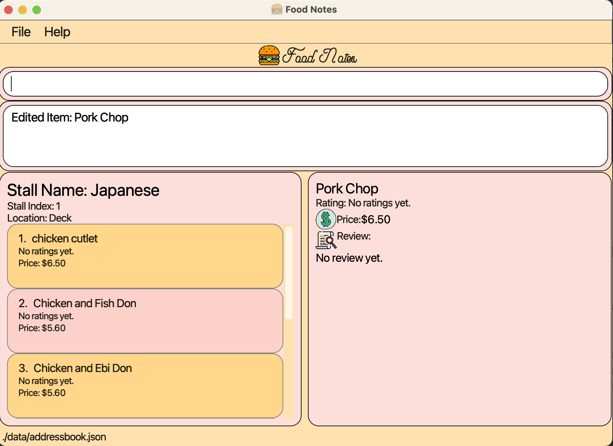

#### Reviewing an item : `review-item`

You can use this command to review an existing item, and add your own star rating and text description for your experience at the stall.

**Format:**

`review-item s/STALL_INDEX i/ITEM_INDEX r/ITEM_RATING d/ITEM_DESCRIPTION`

**Example:**
You wish to review the first item in the first stall after visiting the stall.

Reviewing the item:

1. Type `review-item s/1 i/1 r/4 d/Very Flavourful` into the _Command Box_.
1. Press `Enter` to execute.

Outcome:

1. The _Result Display_ will show a success message.
1. You have now reviewed the first menu item of the first stall, and the star ratings will be reflected.

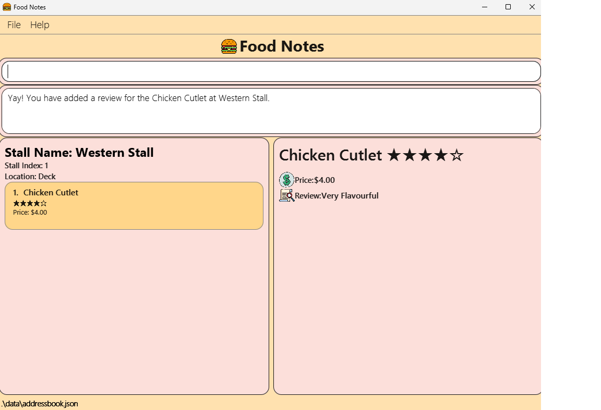

#### Deleting an item review: `delete-item-review`

You can use this command to delete a review of an existing item.

**Format:**

`delete-item-review s/STALL_INDEX i/ITEM_INDEX`

**Example:**
You decide to delete the review for the first item in the first stall.

Deleting the review:

1. Type `delete-item-review s/1 i/1` into the _Command Box_.
1. Press `Enter` to execute.

Outcome:

1. The _Result Display_ will show a success message.
1. You have now deleted the review of the first menu item of the first stall, and the menu will be updated.

--------------------------------------------------------------------------------------------------------------------

## Glossary

| Term         | Explanation                                                                                                                                                                 |
|--------------|-----------------------------------------------------------------------------------------------------------------------------------------------------------------------------|
| **FoodNotes** | Can refer to name of the application as a whole or to the app’s storage file.                                                                                            |
| **Stall**    | Refers to a specific food stall in FoodNotes.                                                                                                                            |
| **Item**     | Refers to a specific menu item from a specific stall in FoodNotes.                                                                                                       |
| **CLI**      | A Command Line Interface (CLI) is a text-based user interface that allows users to type text commands instructing the program to do specific tasks.                         |
| **GUI**      | A Graphical User Interface (GUI) is a form of user interface that allows users to interact with the program through graphical icons instead of text-based user interfaces.  |

--------------------------
## Command summary

### General Commands

| Features  | Format, Examples |
|-----------|------------------|
| **Help**  | `help`           |
| **Exit**  | `exit`           |
| **Clear** | `clear`          |

### Stall Management Commands

| Features                | Format, Examples                                                                                                                   |
|-------------------------|------------------------------------------------------------------------------------------------------------------------------------|
| **List**                | `list`   e.g. `list`                                                                                                            |
| **View stall**          | `view-stall s/STALL_INDEX`   e.g. `view-stall` s/1                                                                              |
| **Add stall**           | `add-stall n/STALL_NAME l/LOCATION`   e.g.`add-stall` n/Japanese Stall l/Deck                                                   |
| **Delete stall**        | `delete-stall s/STALL_INDEX`   e.g. `delete-stall` s/1                                                                          |
| **Edit stall**          | `edit-stall s/STALL_INDEX [n/STALL_NAME] [l/LOCATION] [r/STALL_RATING] [d/STALL_DESCRIPTION]`   e.g. `edit-stall` s/1 l/Terrace |
| **Review stall**        | `review-stall s/STALL_INDEX r/STALL_RATING d/DESCRIPTION`   e.g. `review-stall` s/1 r/5 d/Good food and service                 |                                                                                                                                                             |
| **Delete stall review** | `delete-stall-review s/STALL_INDEX`   e.g. `delete-stall-review` s/1                                                            |

### Stall Sorting Commands

| Features                    | Format, Examples                                        |
|-----------------------------|---------------------------------------------------------|
| **Sort stalls by location** | `sort-stalls-location`   e.g. `sort-stalls-location` |
| **Sort stalls by rating**   | `sort-stalls-rating`   e.g. `sort-stalls-rating`     |
| **Sort stalls by price**    | `sort-stalls-price`   e.g. `sort-stalls-price`       |

### Stall Finding Commands

| Features                    | Format, Examples                                             |
|-----------------------------|--------------------------------------------------------------|
| **Find stalls by name**     | `find-by-name`   e.g. `find-by-name` western japanese     |
| **Find stalls by location** | `find-by-location`   e.g. `find-by-location` deck terrace |
| **Find stalls by item**     | `find-by-item`   e.g. `find-by-item` chicken              |

### Item-Related Commands

| Features               | Format, Examples                                                                                                                              |
|------------------------|-----------------------------------------------------------------------------------------------------------------------------------------------|
| **View item**          | `view-item s/STALL_INDEX i/ITEM_INDEX`   e.g. `view-item` s/1 i/1                                                                          |
| **Add item**           | `add-item s/STALL_INDEX n/ITEM_NAME p/ITEM_PRICE`   e.g.`add-item` s/1 n/Chicken Rice p/4.50                                               |
| **Delete item**        | `delete-item s/STALL_INDEX i/ITEM_INDEX`   e.g. `delete-item` s/1 i/1                                                                      |
| **Edit item**          | `edit-item s/STALL_INDEX i/ITEM_INDEX [n/ITEM_NAME] [p/ITEM_PRICE] [r/ITEM_RATING] [d/ITEM_DESCRIPTION]`   e.g. `edit-item` s/1 i/1 p/5.00 |
| **Review item**        | `review-item s/STALL_INDEX i/ITEM_INDEX r/ITEM_RATING d/ITEM_DESCRIPTION`   e.g. `review-item` s/1 i/1 r/5 d/Flavorful                     |                                                                                                                                                             |
| **Delete item review** | `delete-item-review s/STALL_INDEX i/ITEM_INDEX`   e.g. `delete-item-review` s/1 i/1                                                        |

--------------------------------------------------------------------------------------------------------------------

## FAQ

