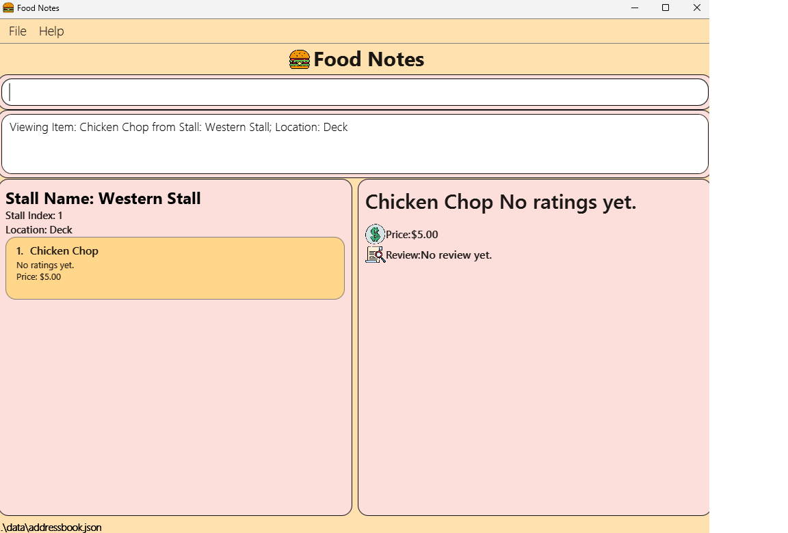
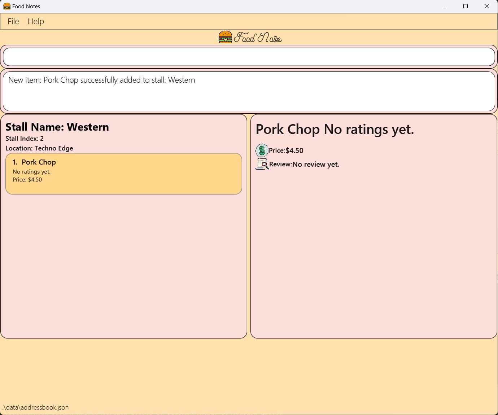

## Table of Contents 

---
1. [Introduction](#1-introduction)
   - [1.1. Purpose](#11-purpose)
2. [About the User Guide](#2-about-the-user-guide)
    - [2.1. Navigating the User Guide](#21-navigating-the-user-guide)
    - [2.2. Reading the User Guide](#22-reading-the-user-guide)
        * [2.2.1. Icons](#icons)
        * [2.2.2. Parameters](#parameters)
        * [2.2.3. GUI](#GUI)
3. [Quick Start](#3-quick-start)
4. [Features](#4-features)
   - 4.1 [General](#41-general)
   - 4.2 [Stall Management](#42-stall-management)
   - 4.3 [Stall Sorting](#43-stall-sorting)
   - 4.4 [Stall Finding](#44-stall-finding)
   - 4.5 [Item Management](#45-item-management)
5. [Glossary](#5-glossary)
6. [Command summary](#6-command-summary)
   - 6.1 [Stall Commands](#61-stall-commands)
   - 6.2 [Item Commands](#62-item-commands)
   - 6.3 [General Commands](#63-general-commands)

# 1. Introduction 
Welcome to the User Guide of **FoodNotes**!

Ever find yourself forgetting the delightful dishes you savored? Hungry for a way to recall your favorite food experiences? FoodNotes has the solution.

FoodNotes is a quick, simple and beautiful food diary made specifically for you, NUS student foodies. With FoodNotes, you can add stalls that you want to keep track of and manage your reviews for them.

This application is optimised for use via a Command Line Interface (CLI) this means that you operate the application by typing commands into a Command Box. If you are fast at typing, you can manage your food reviews faster than other Graphical User Interface (GUI) applications; GUI applications allow users to interact with the application through graphical icons such as buttons.
FoodNotes is available for the Linux, Unix, Windows and Mac OS operating systems.

# 2. About the user guide 
## 2.1 Navigating the user guide 

**For first time users**: 

1) the [Quick start](#quick-start) section provides instructions for you on how to get started. 
2) Once you have set up FoodNotes, you can check out the [Screen layout](#screen-layout) section to get familiar with the different components of FoodNotes. To learn the basics of using FoodNotes, head over to the [Features](#features) section.

**For experienced users:**
1) you can refer to the [Command summary](#command-summary) section for an overview of FoodNotes' commands.

If you have any queries about using FoodNotes, you can check out the [FAQ](#faq) section.

## 2.2 Reading the User Guide 
Before you jump into the next section, take a moment to familiarise yourself with the technical terms, symbols, and syntax used throughout this document. This subsection contains all the essential information you need to understand the content better.

### 2.2.1 Terminology related to the Graphical User Interface (GUI)
The following figure shows the GUI of FoodNotes. It is annotated with the name of the GUI components.

What the main components of the GUI do:

* _Data Display_: This is where **FoodNotes** displays the information of the page that you are viewing.

* _Result Display_: This is where **FoodNotes** displays guiding messages.

* _Command Box_: This is where you type your commands.

### 2.2.2 Icons 

This section will run you through the icons used in this guide.

| Icon                | Meaning                                                          |
|---------------------|------------------------------------------------------------------|
| :information_source: | An information icon indicates that the enclosed text are notes regarding this section. |
| :warning:           | A warning sign indicates that the enclosed text is important, and usually entails details about potential errors. |
|  :bulb:             | A light bulb indicates that the enclosed text is a tip.|

### 2.2.3 Command Syntax and Usage 
Since FoodNotes is a CLI application, knowing how to use commands is very important. The following subsection will teach you how to read and use commands in FoodNotes. All commands in FoodNotes follow similar formats as described below and examples will be provided to help you understand their usage. Examples of commands and their formats will be written in code-blocks.

The table below explains some important technical terms. An example will be provided to help you visualize these terms.

|**Technical Term** | **Meaning**                                                                                                                |
|---------------------|----------------------------------------------------------------------------------------------------------------------------|
| Command word | The first word of a command. It determines the action that **FoodNotes** should perform.                                   |
| Parameter | The word or group of words following the command word. They are values given to a command to perform the specified action. |
| Prefix | A prefix is a word that precedes a parameter. It is used to identify the type of parameter that is being inputted.         |

### 2.2.2 Input parameters 

This section provides a summary of the parameters used when inputting commands into the application.

| Prefix | Parameter          | Meaning                                    | Input                                                  |
|--------|--------------------|--------------------------------------------|--------------------------------------------------------|
| `n/`   | `STALL_NAME`       | Name of the stall                          | Alphanumeric value with 1 to 27 characters (inclusive) |
| `s/`   | `STALL_INDEX`      | Index of the stall in the list             | Integer from 0 to 2147483647 (inclusive)               |
| `l/`   | `STALL_LOCATION`   | Location of the stall                      | Alphanumeric value with 1 to 27 characters (inclusive) |
| `n/`   | `ITEM_NAME`        | Name of the item                           | Alphanumeric value with 1 to 27 characters (inclusive) |
| `i/`   | `ITEM_INDEX`       | Index of the item in the menu              | Integer from 0 to 2147483647 (inclusive)               |
| `p/`   | `ITEM_PRICE`       | Price of the item                          | Non-negative number with 2 decimal places              |
| `r/`   | `STALL_RATING`     | Rating of the stall                        | Integer from 0 to 5 (inclusive)                        |
| `r/`   | `ITEM_RATING`      | Rating of the item                         | Integer from 0 to 5 (inclusive)                        |
| `d/`   | `DESCRIPTION`      | Descriptive review for the stalls or items | Alphanumeric value with 1 to 27 characters (inclusive) |
| N/A    | `NAME_KEYWORD`     | Keyword of the stall name                  | Alphanumeric value with 1 to 27 characters (inclusive) |
| N/A    | `LOCATION_KEYWORD` | Keyword of the stall location              | Alphanumeric value with 1 to 27 characters (inclusive) |
| N/A    | `ITEM_KEYWORD`     | Keyword of the menu items in the stall     | Alphanumeric value with 1 to 27 characters (inclusive) |

--------------------------------------------------------------------------------------------------------------------

## 3. Quick start (To be updated) 

1. Ensure you have Java `11` or above installed in your Computer.

1. Download the latest `FoodNotes.jar` from [here](https://github.com/se-edu/FoodNotes-level3/releases).

1. Copy the file to the folder you want to use as the _home folder_ for your FoodNotes.

1. Open a command terminal, `cd` into the folder you put the jar file in, and use the `java -jar foodnotes.jar` command to run the application. 
   A GUI similar to the below should appear in a few seconds. Note how the app contains some sample data. 
   

1. Type the command in the command box and press Enter to execute it. e.g. typing **`help`** and pressing Enter will open the help window. 
   Some example commands you can try:

   * `add-stall n/Japanese stall l/Deck` : Adds a stall named `Japanese stall` located at `Deck` to the list of stalls.

   * `view-stall s/1` : Shows the 1st stall shown in the current list.

   * `list` : Lists all stalls.

1. Refer to the [Features](#features) below for details of each command.

:bulb: **Tip:** 

* If double-clicking `FoodNotes.jar` does not work,

    1. Search for "Command Prompt" or "Terminal" on your computer.
    2. Navigate to the location where `FoodNotes.jar` is saved via the terminal. (_Unsure how to navigate?_ You can try running this in your terminal: `cd Downloads`.)
    3. Run the following in the terminal: `java -jar FoodNotes.jar`.

:exclamation: **Warning:** 

Upon launching the application, some files responsible for the storage of your data will be created in a folder called `data` located in the same folder as `FoodNotes.jar`. If you are a new user, you are advised not to edit these files. If the changes you made to the data file invalidates its format, FoodNotes will discard all your data and start with an empty data file.

--------------------------------------------------------------------------------------------------------------------

# 4. Features 

---- 

## 4.1 General Features 

The commands in this section allow you to perform operations on the entire system. They include:
- Viewing help
- Exiting from the application

### 4.1.1 Viewing help : `help`

You can use this command to view the online user guide, which contains information about all the instructions in **FoodNotes**.

:information_source: Ensure that you have a stable internet connection and have a web browser on your computer in order to access the user guide.

**Format:**

`help`

**Example:**

In this example, you want to view the user guide to get information about the various commands in **FoodNotes**.

Requesting for help:

1. Type `help` into the *Command Box* and press `Enter` to execute.
2. A new window will appear as shown below. Click on the `Copy URL` button to copy the URL containing the **FoodNotes** user guide.
   
3. Open your preferred web browser on your computer and paste the link into the address bar.
4. Press `Enter` to load the website.

Outcome:

1. Your browser will now show the user guide of **FoodNotes**. 
2. You can now access information about all commands in **FoodNotes** via the browser.

 ### 4.1.2 Exiting from the application: `exit`

You can use this command to exit **FoodNotes**.

**:information_source: This command will exit the application immediately. All data is saved automatically and will be reloaded upon restart of the application**

**Format:**

`exit`

**Example:**

In this example, you want to exit **FoodNotes**.

Exiting the application:

Type `exit` into the *Command Box* and press `Enter` to execute.

Outcome:

The **FoodNotes** application window is now closed.

----
## 4.2 Stall Management 

This feature allows you to manage information about the stalls in **FoodNotes**. You can record and perform the following actions:
- Listing all stalls
- Viewing a stall
- Adding a stall
- Deleting a stall
- Editing a stall
- Reviewing a stall
- Deleting a stall review

### 4.2.1 Listing all stalls : `list`

You can use this command to show a list of all stalls in **FoodNotes**.

**Format:**

`list`

**Example:**

Listing all your stalls:
Type `list` into the *Command Box* and press `Enter` to execute.

Outcome:

1. The Result Display will show a success message.
1. You can now see all your stalls in the *List Panel*.

### 4.2.2 Viewing a stall : `view-stall`

You can use this command to view details from a specific stall from **FoodNotes**.

**Format:**

`view-stall s/STALL_INDEX`

**Example:**

Viewing a specific stall:

1. Type `view-stall s/1` into the *Command Box*.
1. Press `Enter` to execute.

Outcome:

1. The *Result Display* will show a success message.
1. You can now see the details of the specific stall you entered.

### 4.2.3 Adding a stall : `add-stall`

You can use this command to add a new stall to **FoodNotes**.

**Format:**

`add-stall n/STALL_NAME l/LOCATION`

**Example:**

Adding a new stall:

1. Type `add-stall n/Subway l/Utown` into the *Command Box*.
1. Press `Enter` to execute.

Outcome:

1. The *Result Display* will show a success message.
1. You have now added a new stall with the specified name and location.

### 4.2.4 Deleting a stall : `delete-stall`

You can use this command to delete a stall from **FoodNotes**.

**Format:**

`delete-stall s/STALL_INDEX`

**Example:**

Deleting the third stall from the list:

1. Type `delete-stall s/3` into the *Command Box*.
1. Press `Enter` to execute.

Outcome:

1. The *Result Display* will show a success message.
1. You have now deleted the third stall from the list, and the list of stalls will be updated.

### 4.2.5 Editing a stall : `edit-stall`

You can use this command to edit an existing stall, and update its name, location. If the stall has a review, 
you may edit its rating and/or description.

**Format:**

`edit-stall s/STALL_INDEX [n/STALL_NAME] [l/LOCATION] [r/STALL_RATING] [d/STALL_DESCRIPTION] `

**Example:**

Editing the name and location of the first stall from the list:

1. Type `edit-stall s/1 n/Japanese Stall l/Deck` into the *Command Box*.
1. Press `Enter` to execute.

Outcome:

1. The *Result Display* will show a success message.
1. You have now edited the first stall from the list, and the list of stalls will be updated.

### 4.2.6 Reviewing a stall : `review-stall`

You can use this command to review an existing stall, and add your own rating and description for it.

**Format:**

`review-stall s/STALL_INDEX r/STALL_RATING d/STALL_DESCRIPTION`

**Example:**

Reviewing the stall:

1. Type `review-stall s/2 r/5 d/Ambience is great` into the *Command Box*.
1. Press `Enter` to execute.

Outcome:

1. The *Result Display* will show a success message.
1. You have now reviewed the specific stall from the list, and the star ratings will be reflected.

### 4.2.7 Deleting a stall review: `delete-stall-review`

You can use this command to delete a review of an existing stall.

**Format:**

`delete-stall-review s/STALL_INDEX`

**Example:**

Reviewing the stall:

1. Type `delete-stall-review s/2` into the *Command Box*.
1. Press `Enter` to execute.

Outcome:

1. The *Result Display* will show a success message.
1. You have now deleted the review of the specified stall from the list, and the list will be updated.

=======
---------------------------------------------------------------------------------------------------------------------
## 4.3 Stall Sorting 
This feature allows you to sort the stalls by their location, rating and price.

### 4.3.1 Sort stalls by location: `sort-stalls-locations`

You can use this command to sort the stalls by their location in alphabetical order.

**Command format:** `sort-stalls-locations`

**Example:** Type `sort-stalls-locations` in the command box and press Enter.

**Outcome:**
1. The `Result Display` will display a success message.
2. You will now see that the stalls are sorted by location in alphabetical order in the `Data Display`, as illustrated 
   in the screenshot below.

### 4.3.2 Sort stalls by rating: `sort-stalls-ratings`

You can use this command to sort the stalls by their rating in descending order.

**Command format:** `sort-stalls-ratings`

**Example:** Type `sort-stalls-ratings` in the command box and press Enter.

**Outcome:**
1. The `Result Display` will display a success message.
2. You will now see that the stalls are sorted by rating in descending order in the `Data Display`, as illustrated 
   in the screenshot below.

### 4.3.3 Sort stalls by price: `sort-stalls-price`

You can use this command to sort the stalls by their price in ascending order.

**Command format:** sort-stalls-price

**Example:** Type `sort-stalls-price` in the command box and press Enter.

**Outcome:**
1. The `Result Display` will display a success message.
2. You will now see that the stalls are sorted by price in ascending order in the `Data Display`, as illustrated 
   in the screenshot below.

--------------------------------------------------------------------------------------------------------------------

## 4.4 Stall Finding 
This feature allows you to find stalls by their name, location and menu items.

### 4.4.1 Finding stalls by name: `find-by-stall`
The command is a powerful tool for quickly locating specific food stalls based on their names. Even if you can only remember part of the stall name, this command can help you narrow down your choices effectively.
You need to type in the entire word instead of part of the word for it to find the stall.

**Command function:** Finds all stalls whose names contain any of the specified keywords (case-insensitive) and displays them as a list with index numbers.

**Command format:** `find-by-stall NAME_KEYWORD`

Suppose you want to find stalls that serve Japanese and Western noodles. You can use the command as follows:

**Example:** `find-by-stall Japanese Western noodles`

Outcome:
1. The `Result Display` will display a success message.
2. You will now see the matching stalls in the `Data Display`, as illustrated in the screenshot below.

:bulb: **Tip:** 

* You can enter more than one keyword, separated by a space, and all the stalls containing any of the keywords will be listed!

---
### 4.4.2 Find stalls by location: `find-by-location`
The command is a powerful tool for quickly locating specific food stalls based on their locations. If you want to find the nearest food options, this command can help you narrow down your choices effectively.

**Command function:** Finds all stalls whose location contain any of the specified keywords (case-insensitive) and displays them as a list with index numbers.

**Command format:** `find-by-location LOCATION_KEYWORD`

Suppose you want to find stalls that are located at the Deck. You can use the command as follows:

**Example:** `find-by-location deck`

Outcome:
1. The `Result Display` will display a success message.
2. You will now see the matching stalls in the `Data Display`, as illustrated in the screenshot below.

:bulb: **Tip:** 

* You can enter more than one keyword, separated by a space, and all the stalls containing any of the keywords will be listed!

---
### 4.4.3 Find stalls by menu items: `find-by-item`
The command is a powerful tool for quickly locating specific food stalls based on the items on their menu. If you are craving for a specific dish, this command can help you narrow down your choices effectively.

**Command function:** Finds all stalls whose menu items contain any of the specified keywords (case-insensitive) and displays them as a list with index numbers.

**Command format:** `find-by-item ITEM_KEYWORD`

Suppose you want to find stalls that sells chicken rice. You can use the command as follows:

**Example:** `find-by-item chicken rice`

Outcome:
1. The `Result Display` will display a success message.
2. You will now see the matching stalls in the `Data Display`, as illustrated in the screenshot below.

:bulb: **Tip:** 

* You can enter more than one keyword, separated by a space, and all the stalls containing any of the keywords will be listed!

-----
## 4.5 Item Management 
This feature allows you to manage information about the items in **FoodNotes**. You can record and perform the following actions:
- Viewing an item: `view-item`
- Adding an item: `add-item`
- Deleting an item: `delete-item`
- Editing an item: `edit-item`
- Reviewing an item: `review-item`
- Deleting an item review: `delete-item-review`

### 4.5.1 Viewing an item : `view-item`

You can use this command to view details of a specific item from the database.

**Format:**

`view-item s/STALL_INDEX i/ITEM_INDEX`

**Example:**

Viewing a specific item:

1. Type `view-item s/1 i/1` into the *Command Box*.
1. Press `Enter` to execute.

Outcome:

1. The Result Display will show a success message.
1. You can now see the details of the specific item you entered.

### 4.5.2 Adding an item : `add-item`

You can use this command to add a new item to the database.

**Format:**

`add-item s/STALL_INDEX n/ITEM_NAME p/ITEM_PRICE`

**Example:**

Adding a new item:

1. Type `add-item s/1 n/Pork Chop p/5.50` into the *Command Box*.
1. Press `Enter` to execute.

Outcome:

1. The Result Display will show a success message.
1. You have now added a new item with the specified name and price.

### 4.5.3 Deleting an item : `delete-item`

You can use this command to delete an item from the database.

**Format:**

`delete-item s/STALL_INDEX i/ITEM_INDEX`

**Example:**

Deleting the third item from the menu:

1. Type `delete-item s/1 i/2` into the *Command Box*.
1. Press `Enter` to execute.

Outcome:

1. The Result Display will show a success message.
1. You have now deleted the second menu item of the first stall, and the list of items will be updated.

### 4.5.4 Editing an item : `edit-item`

You can use this command to edit an existing item, and update its name, location, rating and/or description.

**Format:**

`edit-item s/STALL_INDEX i/ITEM_INDEX [n/ITEM_NAME] [p/ITEM_PRICE] [r/ITEM_RATING] [d/ITEM_DESCRIPTION] `

**Example:**

Editing the name and location of the first stall from the list:

1. Type `edit-item s/1 i/1 n/Chicken Cutlet p/4.00` into the *Command Box*.
1. Press `Enter` to execute.

Outcome:

1. The Result Display will show a success message.
1. You have now edited the first menu item of the first stall, and the list of items will be updated.

### 4.5.5 Reviewing an item : `review-item`

You can use this command to review an existing item, and add your own rating and description for it.

**Format:**

`review-item s/STALL_INDEX i/ITEM_INDEX r/STALL_RATING d/STALL_DESCRIPTION`

**Example:**

Reviewing the item:

1. Type `review-item s/1 i/1 r/4 d/Very Flavourful` into the *Command Box*.
1. Press `Enter` to execute.

Outcome:

1. The Result Display will show a success message.
1. You have now reviewed the first menu item of the first stall, and the star ratings will be reflected.

### 4.5.6 Deleting an item review: `delete-item-review`

You can use this command to delete a review of an existing item.

**Format:**

`delete-item-review s/STALL_INDEX i/ITEM_INDEX`

**Example:**

Deleting the review:

1. Type `delete-item-review s/1 i/1` into the *Command Box*.
1. Press `Enter` to execute.

Outcome:

1. The Result Display will show a success message.
1. You have now deleted the review of the first menu item of the first stall, and the menu will be updated.

---
--------------------------------------------------------------------------------------------------------------------

  
# 5. Glossary 

| Term              | Explanation                                                                                                                                             |
|-------------------|---------------------------------------------------------------------------------------------------------------------------------------------------------|
| **FoodNotes**     | Can refer to name of the application as a whole or to the app’s storage file.                                                                        |
| **Stalls**        | Refers to the name of the food stall.                                                                                                                |
| **Item**          | Refers to a specific food item.                                                                                                                      |
| **CLI**           | A Command Line Interface (CLI) is a text-based user interface that allows users to type text commands instructing the program to do specific tasks.     |
| **GUI**           | A Graphical User Interface (GUI) is a form of user interface that allows users to interact with the program through graphical icons instead of text-based user interfaces. |
| **Absolute Path** | The complete details needed to locate a file or folder, starting from the root element.                                                                 |

--------------------------
# 6. Command summary 

## 6.1 Stall-Related Commands 

| Features                 | Format, Examples                                                                                                                                                     |
|--------------------------|----------------------------------------------------------------------------------------------------------------------------------------------------------------------|
| **Add stall**            | `add-stall n/<STALL_NAME> l/<LOCATION>`   e.g.`add-stall` n/Japanese Stall l/Deck                                                                                 |
| **View stall**           | `view-stall s/<STALL_NUMBER>`   e.g. `view-stall` s/1                                                                                                             |
| **Delete stall**         | `delete-stall s/<STALL_NUMBER>`   e.g. `delete-stall` s/1                                                                                                         |
| **Review stall**         | `review-stall s/<STALL_NUMBER> r/<STALL_RATING> d/<DESCRIPTION>`   e.g. review-stall s/1 r/5 d/the auntie very chio                                               |                                                                                                                                                             |

## 6.2 Item-Related Commands 

| Features                                  | Format, Examples                                                                                                         |
|-------------------------------------------|--------------------------------------------------------------------------------------------------------------------------|
| **Add item**                              | `add-item s/<STALL_NUMBER> i/<ITEM>`  e.g. `add-item` add-item s/1 i/ChickenRice                                      |
|
| **View item**                             | `view-item s/<STALL_NUMBER> i/<ITEM_NUMBER>`  e.g. `view-item` s/1 i/1                                                |
|
|
| **Delete item**                           | `delete-item s/<STALL_NUMBER> i/<ITEM_NUMBER>`  e.g. `delete-item` s/1 i/1                                            |
| **Rate item**                             | `rate-item s/STALL_NUMBER i/ITEM_NUMBER r/ITEM_RATING d/DESCRIPTION`   e.g. `rate-item` s/1 i/1 r/5 d/th chicken good |
|

## 6.3 General Commands 

| Features | Format, Examples |
|----------|------------------|
| **Help** | `help`           |
| **Exit** | `exit`           |
| **list** | `list`           |

